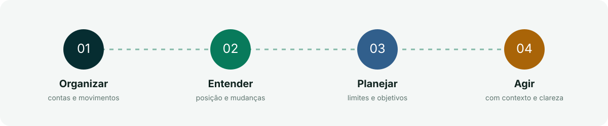
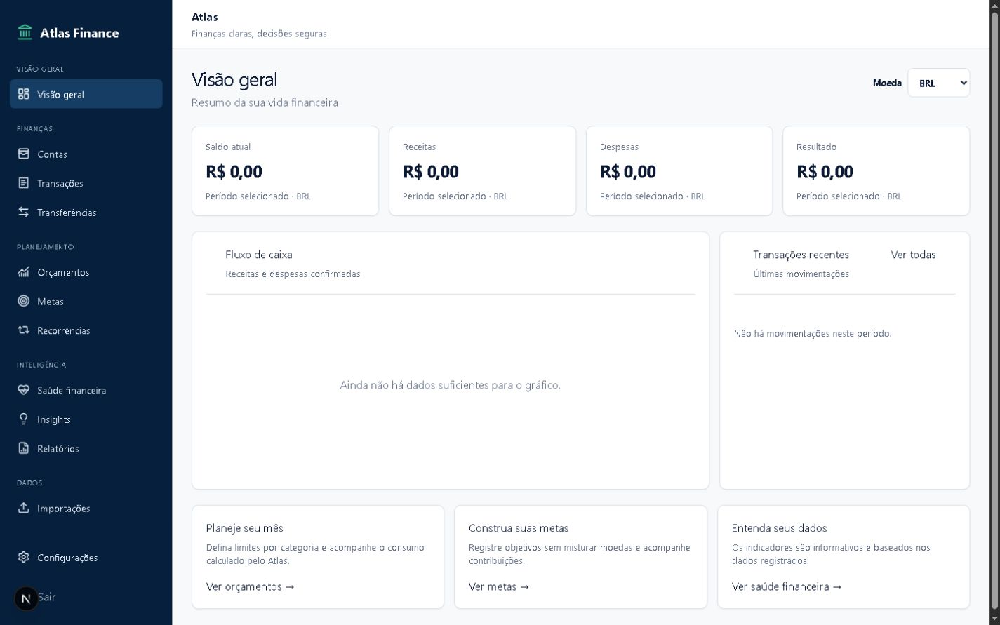
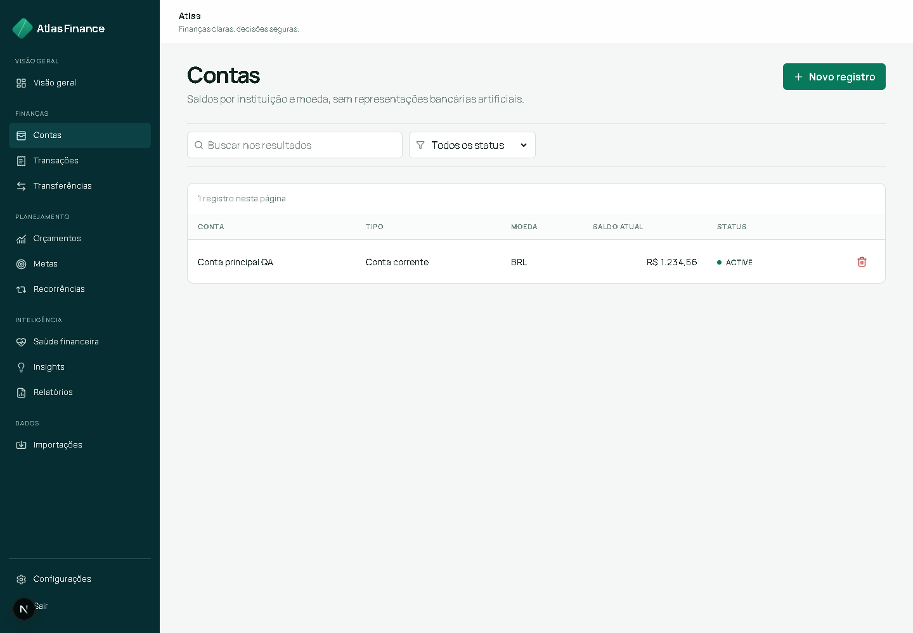
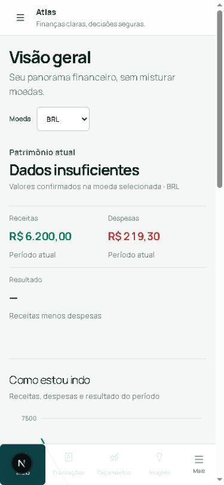
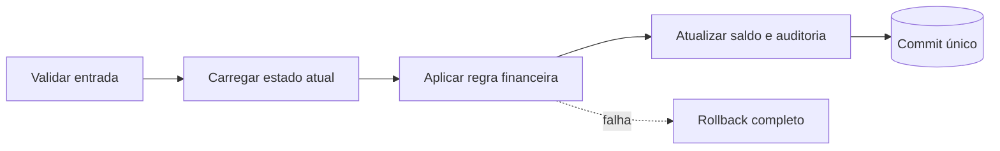
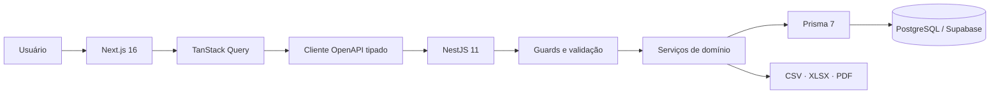
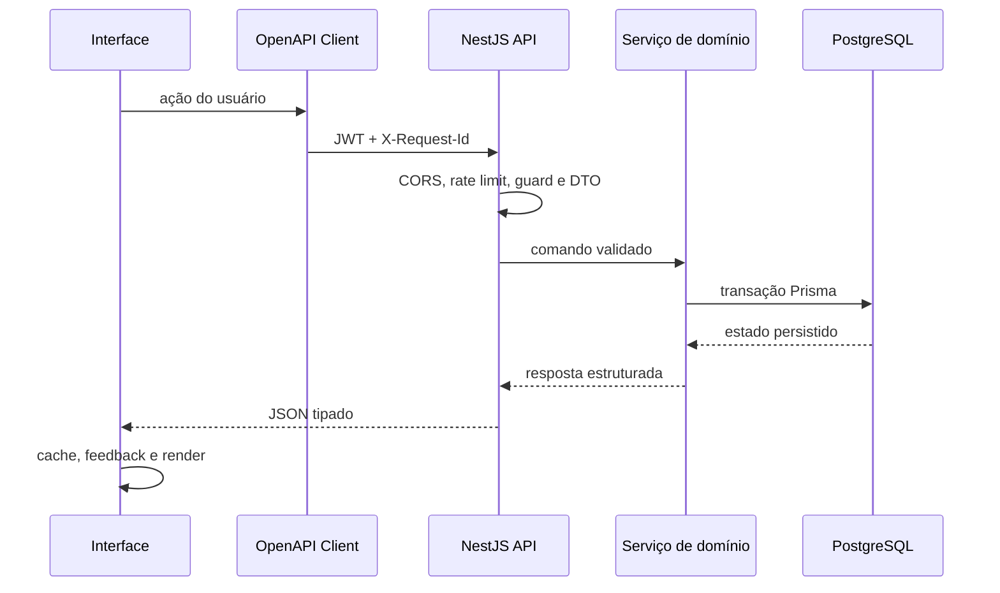
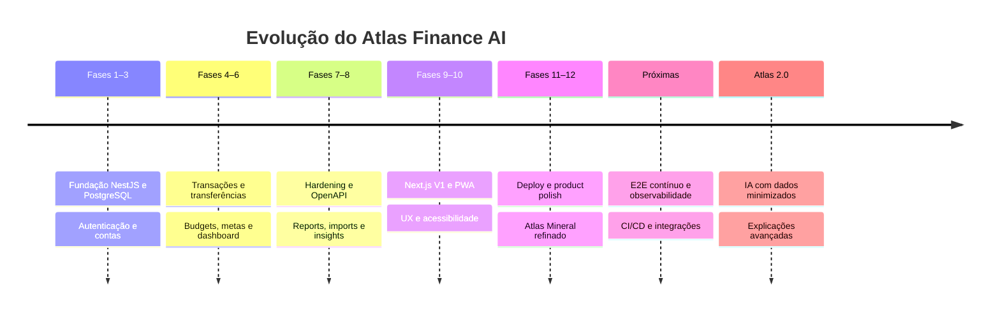

<div align="center">



# Atlas Finance AI

### Gestão financeira pessoal confiável, explicável e multi-moeda.

[](https://nextjs.org/)
[](https://nestjs.com/)
[](https://www.typescriptlang.org/)
[](https://www.postgresql.org/)
[](docs/API.md)
[](#qualidade)
[](docs/UX_PWA_DEPLOYMENT_IMPLEMENTATION_REPORT.md)

[Produto](#o-produto) · [Experiência](#experiência-do-produto) · [Capacidades](#capacidades) · [Arquitetura](#arquitetura) · [Segurança](#segurança) · [Execução](#execução-local) · [Documentação](#documentação)

</div>

---

## O produto

O **Atlas Finance AI** é uma plataforma full-stack de finanças pessoais criada para transformar registros financeiros em entendimento e ação. O produto conecta contas, movimentações, planejamento, diagnósticos e relatórios em uma experiência única — sem sacrificar precisão, segurança ou explicabilidade.

O Atlas não é apenas um registrador de gastos. Ele responde, progressivamente, a quatro perguntas:

1. **Onde está meu dinheiro?** — contas, saldos e patrimônio por moeda.
2. **O que mudou?** — receitas, despesas, transferências e recorrências.
3. **Como estou?** — orçamentos, metas, reserva e saúde financeira.
4. **O que merece atenção?** — insights determinísticos, relatórios e próximos passos.



### Por que ele existe

Aplicações financeiras frequentemente acumulam números sem produzir entendimento. O Atlas adota outra abordagem: cada área tem uma pergunta central, uma hierarquia própria e contexto suficiente para o usuário compreender o que vê.

> **Familiaridade na interação. Identidade na composição. Confiabilidade nas regras.**

### Princípios

- **Confiabilidade antes de conveniência:** regras financeiras críticas vivem no backend.
- **Explicabilidade antes de magia:** score e insights mostram sua base.
- **Moeda é domínio:** BRL, USD e EUR nunca são somados implicitamente.
- **Dados insuficientes não viram zero:** a interface comunica limites de análise.
- **Segurança faz parte do produto:** autenticação, autorização e privacidade são estruturais.
- **IA não é autoridade financeira:** a versão atual usa insights determinísticos e auditáveis.

---

## Experiência do produto

O design system **Atlas Mineral** combina clareza editorial, densidade de produto financeiro e uma identidade inspirada em orientação, trajetórias e camadas de informação. O resultado evita tanto o “dashboard administrativo genérico” quanto interfaces experimentais difíceis de usar.

### Financial Briefing

O dashboard prioriza posição financeira, comportamento do período, sinais relevantes e próxima ação. Cada moeda é analisada separadamente e a ausência de informação nunca é apresentada como falsa precisão.



### Mapa financeiro de contas

Contas são organizadas por instituição, tipo, moeda, saldo e status. Formulários utilizam nomes humanos e exemplos; identificadores internos permanecem apenas no contrato entre frontend e API.



### Experiência responsiva

No desktop, o Atlas privilegia tabelas, leitura comparativa e densidade. Em telas menores, a sidebar se transforma em navegação móvel e tabelas financeiras viram listas estruturadas, sem comprimir a versão desktop.

<p align="center">
  
</p>

### Linguagem de interface

- labels persistentes, placeholders úteis e helper texts contextuais;
- selects de entidade como `Nubank · Conta digital · BRL`, nunca UUIDs;
- erros próximos ao campo e mensagens técnicas sanitizadas;
- empty states educativos com próximo passo real;
- diálogos acessíveis para ações destrutivas;
- status comunicado por texto, ícone e cor;
- `prefers-reduced-motion`, foco visível e touch targets adequados.

---

## Capacidades

| Domínio | O que o Atlas entrega |
| --- | --- |
| **Autenticação** | Cadastro, login, access token, refresh rotativo, sessão e logout |
| **Contas e categorias** | Contas multi-moeda, categorias globais/pessoais, saldos e arquivamento |
| **Transações** | Receitas, despesas e ajustes com filtros, auditoria e impacto atômico |
| **Transferências** | Débito e crédito atômicos, neutralidade patrimonial e mesma moeda |
| **Orçamentos** | Limites mensais por categoria, consumo, restante e alertas |
| **Metas** | Objetivos, contribuições, retiradas, progresso, prioridade e prazo |
| **Reserva de emergência** | Cobertura em meses, progresso e diagnóstico explicável |
| **Recorrências** | Compromissos futuros, frequência, pausa, retomada e execução idempotente |
| **Dashboard** | Patrimônio, fluxo de caixa, mudanças, atenção e movimentos recentes |
| **Saúde financeira** | Score determinístico, qualidade dos dados, pesos, fatores e recomendações |
| **Insights** | Detectores determinísticos, severidade, deduplicação e ciclo de vida |
| **Importações** | CSV, OFX e QFX com parsing, preview, revisão e deduplicação |
| **Relatórios** | Resumo, fluxo de caixa, categorias, patrimônio, metas e orçamentos |
| **Exportações** | Documentos CSV, XLSX e PDF gerados no backend |
| **Operação** | Health, liveness, readiness, request ID e shutdown gracioso |

### Regras financeiras preservadas

#### Dinheiro sem ponto flutuante

Valores monetários trafegam como strings decimais e são persistidos em `DECIMAL(19,4)`. O frontend formata a apresentação, mas nunca se torna fonte de verdade para os cálculos.

```json
{
  "currency": "BRL",
  "amount": "1250.0000"
}
```

#### Múltiplas moedas sem soma implícita

```json
{
  "balances": [
    { "currency": "BRL", "amount": "4500.0000" },
    { "currency": "USD", "amount": "200.0000" }
  ]
}
```

Não existe conversão cambial automática. Dashboard, relatórios, metas, budgets e score preservam o contexto da moeda selecionada.

#### Atualizações atômicas



#### Datas com significado

- datas civis usam `YYYY-MM-DD`;
- instantes usam ISO 8601/UTC;
- o frontend não converte datas civis de forma que altere o dia;
- recorrências respeitam o último dia válido de cada mês.

---

## Arquitetura

O Atlas é um monorepo TypeScript com frontend Next.js, API NestJS, PostgreSQL/Supabase e contrato OpenAPI compartilhado.



### Responsabilidades

| Camada | Responsabilidade |
| --- | --- |
| **Next.js App Router** | Rotas, shell, composição responsiva, PWA e estados da interface |
| **React + TanStack Query** | Interação, mutations, cache e deduplicação de requests |
| **Typed OpenAPI client** | Transporte HTTP consistente e tipos gerados pelo contrato |
| **NestJS** | Autenticação, autorização, validação e regras de negócio |
| **Prisma** | Acesso tipado, transações e precisão decimal |
| **PostgreSQL/Supabase** | Fonte de verdade, integridade relacional e persistência |

### Estrutura do repositório

```text
atlas-finance-ai/
├── apps/
│   ├── api/                  # API NestJS e contrato OpenAPI
│   └── web/                  # Aplicação Next.js e PWA
├── docs/                     # Produto, arquitetura, segurança e relatórios
├── packages/                 # Código compartilhado
├── prisma/
│   ├── schema.prisma         # Modelo relacional
│   └── migrations/           # Evolução versionada
├── scripts/                  # Geração de contrato e verificações
├── supabase/                 # Políticas e configuração PostgreSQL
├── render.yaml               # Infraestrutura de deploy
└── package.json              # Orquestração do monorepo
```

### Fluxo de uma requisição



---

## Segurança

O modelo de segurança assume que toda entrada é não confiável e que dados financeiros pertencem exclusivamente ao usuário autenticado.

- JWT de curta duração e refresh token rotativo;
- hash de senha com Argon2;
- guards de autenticação e autorização por recurso;
- proteção contra IDOR em serviços e queries;
- DTOs com whitelist e rejeição de campos extras;
- rate limiting, Helmet, CORS explícito e limites de payload;
- request IDs e erros sanitizados, sem stack ou Prisma errors na UI;
- secrets apenas em variáveis de ambiente;
- PWA sem cachear respostas financeiras autenticadas;
- auditoria de operações financeiras relevantes.

Leia o modelo completo em [docs/SECURITY.md](docs/SECURITY.md).

---

## Stack

| Área | Tecnologias |
| --- | --- |
| Frontend | Next.js 16, React, TypeScript, Tailwind CSS |
| Estado e dados | TanStack Query, Zustand, React Hook Form, Zod |
| Interface | Radix UI, Lucide, Recharts, Sonner |
| Backend | NestJS 11, class-validator, JWT, Argon2 |
| Banco | PostgreSQL/Supabase, Prisma 7, `Decimal(19,4)` |
| Contrato | OpenAPI 3, Swagger, openapi-typescript |
| Arquivos | CSV, ExcelJS/XLSX, PDFKit |
| Qualidade | Jest, Vitest, Testing Library, ESLint, TypeScript strict |
| Deploy | Render, serviços web independentes para API e frontend |

---

## Execução local

### Requisitos

- Node.js `>=22 <23`;
- npm;
- PostgreSQL compatível ou projeto Supabase;
- variáveis de ambiente baseadas em [.env.example](.env.example).

### 1. Instalar

```bash
git clone https://github.com/oluisvi/atlas-finance-ai.git
cd atlas-finance-ai
npm install
npm --prefix apps/web install
```

### 2. Configurar o ambiente

```bash
npm run setup:env
```

Preencha as variáveis obrigatórias sem versionar arquivos `.env`:

```dotenv
DATABASE_URL="postgresql://..."
DIRECT_URL="postgresql://..."
JWT_ACCESS_SECRET="..."
JWT_REFRESH_SECRET="..."
CORS_ORIGIN="http://localhost:3001"
NEXT_PUBLIC_API_URL="http://localhost:3000/api/v1"
```

### 3. Preparar banco e contrato

```bash
npm run prisma:validate
npm run prisma:generate
npm run prisma:migrate:deploy
npm run api:generate
```

### 4. Executar

Em terminais separados:

```bash
# API — http://localhost:3000/api/v1
npm run start:api

# Web — http://localhost:3001
npm run dev:web
```

### Scripts principais

| Comando | Finalidade |
| --- | --- |
| `npm run start:api` | Compilar e iniciar a API |
| `npm run dev:web` | Iniciar o frontend em desenvolvimento |
| `npm run api:generate` | Atualizar OpenAPI e cliente TypeScript |
| `npm run prisma:validate` | Validar o schema Prisma |
| `npm run prisma:generate` | Gerar o Prisma Client |
| `npm run typecheck` | Verificar API e web em modo strict |
| `npm run test` | Executar todos os testes |
| `npm run lint` | Executar ESLint no monorepo |
| `npm run build` | Gerar builds de produção |
| `npm run db:verify-catalog` | Conferir o catálogo PostgreSQL |

---

## Qualidade

Última bateria integral executada na Fase 12:

| Aplicação | Suítes | Testes | Resultado |
| --- | ---: | ---: | :---: |
| API NestJS | 37 | 288 | ✅ |
| Web Next.js | 5 | 15 | ✅ |
| **Total** | **42** | **303** | **✅** |

```bash
npm run prisma:validate   # passou
npm run prisma:generate   # passou
npm run api:generate      # passou
npm run typecheck         # passou
npm run test              # 303 testes aprovados
npm run lint              # passou
npm run build             # API + Next.js passaram
git diff --check           # passou
```

Além da automação, o frontend é validado em browser quanto a conteúdo significativo, overlays do framework, console, interação, responsividade e estados de erro. O relatório da fase mais recente está em [docs/PHASE_12_PRODUCT_POLISH_REPORT.md](docs/PHASE_12_PRODUCT_POLISH_REPORT.md).

---

## Deploy

O [render.yaml](render.yaml) define dois serviços independentes:

| Serviço | Responsabilidade |
| --- | --- |
| `atlas-finance-api` | API NestJS, Prisma e health checks |
| `atlas-finance-web` | Aplicação Next.js de produção |

O deploy usa build filters, Node 22, health check em `/api/v1/health/readiness` e variáveis sensíveis configuradas diretamente no Render. Nenhum secret é armazenado no manifesto.

---

## Documentação

| Documento | Conteúdo |
| --- | --- |
| [PRD](docs/PRD.md) | Problema, público, objetivos e requisitos |
| [Arquitetura](docs/ARCHITECTURE.md) | Componentes, responsabilidades e fluxos |
| [API](docs/API.md) | Contrato HTTP e convenções públicas |
| [Banco de dados](docs/DATABASE.md) | Modelo, integridade e persistência |
| [Segurança](docs/SECURITY.md) | Threat model, controles e operação segura |
| [Design System](docs/DESIGN_SYSTEM.md) | Tokens, componentes e linguagem Atlas Mineral |
| [Diretrizes de UX](docs/UX_GUIDELINES.md) | Nielsen, formulários, estados e responsividade |
| [Fase 12](docs/PHASE_12_PRODUCT_POLISH_REPORT.md) | Auditoria e polimento de produto |
| [Deployment](docs/DEPLOYMENT.md) | Ambientes, Render e checklist operacional |
| [Roadmap](docs/ROADMAP.md) | Evolução planejada do produto |

Os demais relatórios em [`docs/`](docs/) registram decisões, invariantes, endpoints, testes e limitações de cada domínio.

---

## Estado do produto

| Área | Estado |
| --- | :---: |
| Backend, banco e autenticação | ✅ Concluído |
| Domínios financeiros principais | ✅ Concluído |
| Dashboard, score e insights | ✅ Concluído |
| Imports, relatórios e exportações | ✅ Concluído |
| OpenAPI e cliente tipado | ✅ Concluído |
| Frontend responsivo Atlas Mineral | ✅ Concluído |
| PWA segura | ✅ Concluído |
| Polimento de produto — Fase 12 | ✅ Concluído |
| E2E contínuo multi-browser | 🔜 Próxima evolução |
| Observabilidade e CI/CD completos | 🔜 Próxima evolução |
| IA generativa e integrações avançadas | 🔭 Futuro |

### O que o Atlas não faz hoje

- não movimenta dinheiro ou conecta contas via Open Finance;
- não executa investimentos ou conversão cambial;
- não oferece recomendações financeiras geradas por IA;
- não depende de Redis, filas ou workers para a V1 funcionar;
- não promete operação financeira completa offline.

Essas fronteiras são deliberadas: a versão atual prioriza uma base financeira correta, segura e explicável.

---

## Roadmap



---

## Autor

Desenvolvido por **Luis Henrique Vieira**.

[](https://github.com/oluisvi)

## Licença

Este projeto ainda não possui licença pública definida. Até que uma licença seja adicionada, todos os direitos permanecem reservados ao autor.

---

<div align="center">

### Atlas Finance AI

**Reliable financial rules. Clear indicators. Better decisions.**

</div>
