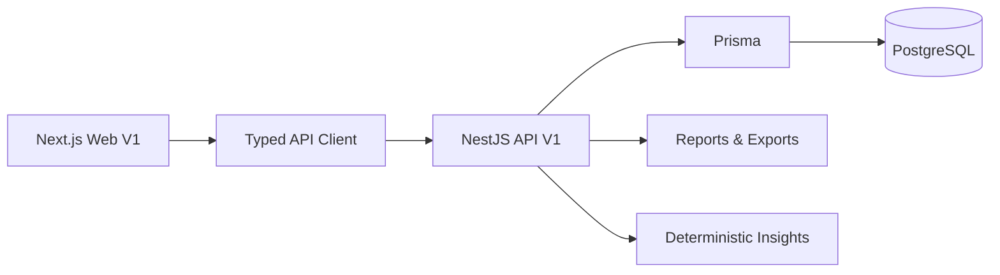

<div align="center">

# Atlas Finance AI

### Gestão financeira confiável, do dado à decisão.

Uma plataforma full-stack para organizar contas, movimentações, planejamento financeiro, indicadores e análises determinísticas em uma experiência web responsiva.

[](https://www.typescriptlang.org/)
[](https://nextjs.org/)
[](https://nestjs.com/)
[](https://www.prisma.io/)
[](https://www.postgresql.org/)
[](#qualidade)

[Produto](#o-produto) · [Funcionalidades](#funcionalidades) · [Arquitetura](#arquitetura) · [Execução local](#execução-local) · [API](#contrato-da-api) · [Roadmap](#roadmap)

</div>

---

## O produto

O Atlas centraliza a vida financeira pessoal sem transferir regras críticas para o navegador. O backend calcula saldos, consumo de orçamento, progresso de metas, relatórios, score e insights; o frontend apresenta esses resultados, coleta entradas e mantém uma experiência consistente em desktop, tablet e mobile.

O projeto está atualmente na **Fase 9**, com o backend V1 e o frontend web V1 implementados. IA generativa, PWA, notificações e deploy ainda não fazem parte da versão atual.

### Dashboard web


### Gestão de contas


### Experiência mobile

<p align="center">
  
</p>

---

## Funcionalidades

| Área | Entregue na V1 |
| --- | --- |
| Autenticação | Cadastro, login, sessão, refresh single-flight, perfil e logout |
| Dashboard | Saldo, receitas, despesas, resultado, fluxo de caixa e movimentações recentes |
| Contas | Criação, listagem, atualização, arquivamento e exclusão lógica |
| Transações | Receitas, despesas, ajustes, filtros, paginação, edição e remoção |
| Transferências | Movimentação atômica entre contas e histórico |
| Planejamento | Orçamentos por categoria, metas, reserva de emergência e recorrências |
| Dados | Importação CSV, OFX e QFX com revisão e confirmação |
| Inteligência financeira | Saúde financeira e insights determinísticos e explicáveis |
| Relatórios | Resumos, fluxo de caixa, categorias, patrimônio, metas e exportações CSV/XLSX/PDF |
| Interface | Estados de loading, erro e vazio; formulários validados; desktop, tablet e mobile |

### Princípios financeiros

- dinheiro viaja pela API como **string decimal**, nunca como ponto flutuante;
- moedas diferentes nunca são somadas ou convertidas implicitamente;
- datas civis preservam `YYYY-MM-DD` sem mudança de dia por fuso horário;
- operações financeiras dependentes são atômicas;
- o PostgreSQL é a fonte de verdade;
- o frontend não duplica fórmulas financeiras do backend;
- os insights atuais são determinísticos e não são apresentados como IA.

---

## Arquitetura



```text
apps/
├── api/                       # API NestJS modular
└── web/                       # Aplicação Next.js App Router
    └── src/
        ├── app/               # Rotas e layouts
        ├── components/        # Shell, páginas e componentes reutilizáveis
        ├── lib/api/           # Transporte e schema OpenAPI gerado
        ├── stores/            # Estado global mínimo de autenticação
        └── test/              # Configuração de testes frontend

docs/                          # Contratos e relatórios de implementação
prisma/                        # Schema e migrations versionadas
supabase/                      # Configuração e políticas de banco
```

### Frontend

- Next.js 16 e React com App Router;
- TypeScript strict;
- Tailwind CSS 4 e tokens semânticos;
- TanStack Query para cache e estado de servidor;
- Zustand apenas para sessão global;
- React Hook Form e Zod;
- Recharts com carregamento dinâmico;
- Vitest e Testing Library.

### Backend

- NestJS 11 e arquitetura modular por domínio;
- Prisma 7 com PostgreSQL/Supabase;
- JWT access/refresh com rotação e revogação;
- `ValidationPipe` estrito, Helmet, CORS allowlist e rate limiting;
- request ID, logs estruturados, erros sanitizados e graceful shutdown;
- Swagger/OpenAPI 3 com 86 operações documentadas;
- Jest e Supertest.

---

## Contrato da API

A API V1 usa o prefixo `/api/v1`. Com Swagger habilitado:

- Swagger UI: `http://localhost:3000/api/docs`
- OpenAPI JSON: `http://localhost:3000/api/docs-json`
- Health: `http://localhost:3000/api/v1/health`

O schema TypeScript do frontend é gerado a partir do contrato real:

```bash
npm run api:generate
```

Convenções importantes:

- `Authorization: Bearer <access_token>`;
- erros no formato `{ statusCode, code, message, method, path, requestId, timestamp }`;
- coleções paginadas com `data` e `meta`;
- imports em `multipart/form-data`, limitados a 10 MB;
- exports retornam resposta binária, não JSON em Base64.

Consulte [docs/API.md](docs/API.md) e [docs/OPENAPI_IMPLEMENTATION_REPORT.md](docs/OPENAPI_IMPLEMENTATION_REPORT.md).

---

## Execução local

### Requisitos

- Node.js compatível com as dependências do projeto;
- npm;
- PostgreSQL/Supabase acessível;
- variáveis definidas a partir de `.env.example`.

### Instalação

```bash
git clone https://github.com/oluisvi/atlas-finance-ai.git
cd atlas-finance-ai
npm install
npm --prefix apps/web install
cp .env.example .env
```

Preencha as URLs do banco e os secrets JWT no `.env`. Para o frontend, configure:

```env
NEXT_PUBLIC_API_URL=http://localhost:3000/api/v1
```

### Banco e geração de código

```bash
npm run prisma:validate
npm run prisma:generate
npm run prisma:migrate:deploy
```

### Desenvolvimento

Em terminais separados:

```bash
npm run start:api
npm run dev:web
```

- API: `http://localhost:3000`
- Web: `http://localhost:3001`

### Comandos principais

```bash
npm run typecheck        # backend + frontend
npm run test             # backend + frontend
npm run lint             # backend + frontend
npm run build            # backend + frontend
npm run api:generate     # atualiza os tipos derivados do OpenAPI
```

---

## Qualidade

Estado validado da Fase 9:

- **37 suítes e 288 testes de backend**;
- **3 arquivos e 13 testes de frontend**;
- **301 testes aprovados no total**;
- Prisma validate e generate aprovados;
- typecheck, testes, lint e builds de produção aprovados;
- QA no navegador em 1440, 1280, 768 e 390 px;
- sem alteração do schema Prisma, migrations ou RLS durante a implementação do frontend.

O frontend foi validado em fluxos reais de cadastro, login, sessão, dashboard, criação de conta, navegação e estados de banco vazio.

---

## Segurança

- nenhum `userId` financeiro é aceito como fonte de ownership;
- consultas financeiras são segregadas pelo usuário autenticado;
- JWTs usam issuer, audience, expiração e sessões revogáveis;
- payloads desconhecidos são rejeitados;
- respostas financeiras usam política `no-store`;
- uploads e downloads são tratados por uma camada central;
- tokens, senhas e connection strings não são registrados em logs;
- Supabase Auth não é utilizado: a autenticação pertence à API NestJS.

Na arquitetura atual, os tokens são retornados no corpo pela API e a sessão web usa memória mais `sessionStorage`. A migração do refresh token para cookie HTTP-only permanece uma melhoria futura documentada.

---

## Documentação

- [Arquitetura](docs/ARCHITECTURE.md)
- [Contrato da API](docs/API.md)
- [Relatório OpenAPI](docs/OPENAPI_IMPLEMENTATION_REPORT.md)
- [Relatório do frontend V1](docs/FRONTEND_IMPLEMENTATION_REPORT.md)
- [Relatório de hardening](docs/BACKEND_HARDENING_REPORT.md)

---

## Roadmap

### Entregue

- [x] Modelagem PostgreSQL e Prisma
- [x] API NestJS V1 e autenticação própria
- [x] Motor financeiro e CRUDs principais
- [x] Dashboard, score, reports, exports e insights determinísticos
- [x] Hardening e contrato OpenAPI
- [x] Frontend Next.js V1 responsivo

### Próximas fases

- [ ] PWA, UX e acessibilidade aprofundada
- [ ] E2E completo e datasets automatizados
- [ ] CI/CD e deploy
- [ ] Serviços assíncronos, Redis e notificações
- [ ] Camada de IA do Atlas 2.0, sem substituir cálculos determinísticos

---

<div align="center">

**Atlas Finance AI — dados confiáveis antes de decisões inteligentes.**

</div>
