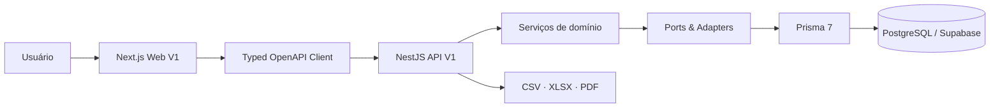
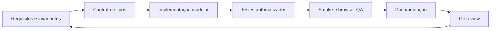
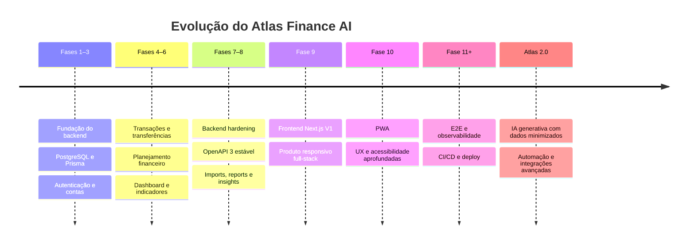

<div align="center">

# Atlas Finance AI

### Gestão financeira confiável, do dado à decisão.

Plataforma full-stack de finanças pessoais que transforma registros financeiros em planejamento, indicadores explicáveis e decisões mais claras — sem tirar do backend a responsabilidade pelas regras críticas.

[](https://www.typescriptlang.org/)
[](https://nextjs.org/)
[](https://nestjs.com/)
[](https://www.prisma.io/)
[](https://www.postgresql.org/)
[](docs/API.md)
[](#qualidade-e-validação)

[Produto](#visão-do-produto) · [Experiência](#o-produto-em-uso) · [Domínios](#capacidades-do-sistema) · [Arquitetura](#arquitetura) · [Metodologia](#metodologia-de-engenharia) · [Execução](#execução-local) · [Documentação](#mapa-da-documentação) · [Roadmap](#roadmap)

</div>

---

## Visão do produto

O Atlas Finance AI nasce de uma ideia simples: registrar gastos não é suficiente. Um produto financeiro útil precisa organizar a informação, preservar a integridade dos números, explicar o cenário atual e criar um caminho seguro entre **dados**, **entendimento** e **ação**.

Hoje, na **Fase 10**, o repositório contém uma V1 full-stack funcional com experiência Atlas Mineral, acessibilidade baseline, PWA segura e preview Render preparado:

- backend modular e hardened em NestJS;
- frontend responsivo em Next.js;
- persistência PostgreSQL com Prisma;
- contrato HTTP OpenAPI estável;
- autenticação própria com JWT e rotação de refresh token;
- domínios financeiros completos, do registro à análise;
- relatórios e exportações em múltiplos formatos;
- Financial Health Score e insights determinísticos explicáveis;
- 301 testes automatizados entre backend e frontend.

O nome preserva a visão de longo prazo do produto, mas a versão atual **não usa IA generativa**. Os insights existentes são derivados de regras determinísticas, auditáveis e testáveis. PWA está implementada sem persistir respostas financeiras autenticadas. IA, notifications engine, Redis/workers e scheduler pertencem a fases futuras. O deploy no Render está pronto para provisionamento; consulte [Deployment](docs/DEPLOYMENT.md).

### Da organização à decisão

```text
Organizar                    Entender                     Agir
──────────────────          ──────────────────           ──────────────────
Contas                      Dashboard                    Orçamentos
Transações                  Relatórios                   Metas
Transferências              Saúde financeira            Reserva de emergência
Importações                 Insights explicáveis        Recorrências
```

### Princípios de produto

- **Confiabilidade antes de conveniência:** nenhuma regra crítica depende apenas do navegador.
- **Explicabilidade antes de magia:** score e insights precisam mostrar de onde vêm.
- **Moeda é domínio, não detalhe visual:** BRL, USD e EUR permanecem separados.
- **Dados insuficientes geram contexto, não falsa precisão.**
- **A IA futura será uma camada de explicação, não autoridade sobre saldos ou movimentações.**
- **Segurança e privacidade fazem parte da arquitetura desde a entrada HTTP.**

---

## O produto em uso

### Dashboard financeiro

Visão consolidada por moeda com saldo, receitas, despesas, resultado do período, fluxo de caixa e movimentações recentes.


### Gestão de contas

Contas organizadas por instituição, tipo, moeda, saldo atual e situação operacional.


### Experiência responsiva

O shell adapta a navegação para desktop, tablet e mobile, preservando hierarquia, leitura e acesso às áreas principais.

<p align="center">
  
</p>

---

## Capacidades do sistema

| Domínio | O que a V1 entrega |
| --- | --- |
| Autenticação e usuários | Cadastro, login, perfil, access token, refresh rotativo, sessão persistida e logout |
| Contas e categorias | Contas multi-moeda, categorias pessoais/globais, saldo inicial imutável, arquivamento e soft delete |
| Transações | Receitas, despesas e ajustes; filtros, paginação, atualização, auditoria e impacto atômico no saldo |
| Transferências | Débito e crédito atômicos, mesma moeda, histórico vinculado e reversão segura |
| Orçamentos | Limites mensais por categoria, consumo, restante e estados `NORMAL`, `ALERT` e `EXCEEDED` |
| Metas e reserva | Objetivos, contribuições, saques, reversões, progresso e reserva de emergência |
| Recorrências | Receitas/despesas previstas, pausa, retomada, cancelamento e execução idempotente |
| Dashboard | Overview, fluxo de caixa, categorias, contas, budgets, metas, recorrências e transações recentes |
| Saúde financeira | Score determinístico, componentes ponderados, qualidade dos dados, fatores e recomendações estruturadas |
| Importações | CSV, OFX e QFX; parsing, preview, revisão, deduplicação e confirmação |
| Relatórios | Resumos, fluxo de caixa, categorias, patrimônio e progresso de metas |
| Exportações | Geração binária em CSV, XLSX e PDF |
| Insights | Detectores determinísticos, fingerprint, deduplicação, leitura, dispensa, resolução e reativação |
| Operação | Health, liveness, readiness, request ID, logging estruturado e shutdown gracioso |

### Regras financeiras essenciais

#### Dinheiro sem ponto flutuante

Valores trafegam na API como **strings decimais** e são persistidos em `DECIMAL(19,4)`. O frontend formata valores para exibição, mas não usa `float` como fonte de verdade para cálculos financeiros.

```json
{
  "currency": "BRL",
  "amount": "1250.0000"
}
```

#### Moedas nunca são somadas implicitamente

```json
{
  "balances": [
    { "currency": "BRL", "amount": "4500.0000" },
    { "currency": "USD", "amount": "200.0000" }
  ]
}
```

Indicadores, dashboard, relatórios e score preservam o contexto da moeda. A V1 não executa conversão cambial automática.

#### Atualizações financeiras são atômicas

```text
Reverter impacto anterior
            ↓
Validar e aplicar novos dados
            ↓
Atualizar saldo e auditoria
            ↓
Commit único no PostgreSQL
```

Se qualquer etapa falhar, toda a operação é revertida.

#### Datas preservam significado

- datas civis usam `YYYY-MM-DD`;
- instantes usam ISO 8601/UTC;
- o frontend evita conversões que alterem o dia pelo fuso horário;
- recorrências mensais respeitam o último dia válido de cada mês.

---

## Arquitetura

O Atlas é um monorepo TypeScript organizado em duas aplicações e uma camada compartilhada de persistência e documentação.



### Fluxo de responsabilidade

```text
Backend
   ↓
Contrato OpenAPI
   ↓
Cliente TypeScript tipado
   ↓
TanStack Query e hooks de feature
   ↓
Componentes e páginas
```

O frontend apresenta dados, coleta entradas, valida a experiência e coordena cache. O backend continua sendo fonte de verdade para saldo, consumo de orçamento, progresso de metas, transferências, score, relatórios, imports e insights.

### Estrutura do monorepo

```text
atlas-finance-ai/
├── apps/
│   ├── api/                    # API NestJS, módulos e contrato HTTP
│   │   └── src/
│   │       ├── config/         # Ambiente, Swagger e throttling
│   │       ├── modules/        # Domínios de negócio
│   │       └── shared/         # Pipeline HTTP, filtros e middleware
│   └── web/                    # Produto web Next.js
│       └── src/
│           ├── app/            # App Router e rotas
│           ├── components/     # Shell, dashboard e páginas de recurso
│           ├── lib/            # Transporte, tipos OpenAPI e formatadores
│           └── stores/         # Estado de autenticação
├── prisma/
│   ├── schema.prisma           # Fonte de verdade do modelo relacional
│   └── migrations/             # Evolução versionada do banco
├── supabase/
│   └── rls/                    # Políticas RLS recomendadas
├── scripts/                    # Setup e verificações de catálogo
└── docs/                       # PRD, arquitetura, segurança e relatórios de fase
```

### Backend modular

```text
Auth · Users · Accounts · Categories · Transactions · Transfers
Budgets · Goals · Recurring Transactions · Dashboard
Financial Health · Imports · Reports · Exports · Insights
Audit · Health · Prisma
```

Cada módulo concentra controller, DTOs, serviço e testes. Os domínios financeiros usam injeção de dependência e portas/adapters quando isso protege as regras do acoplamento direto ao Prisma.

### Request pipeline hardened

```mermaid
flowchart LR
    REQ["Request"] --> CORS["CORS allowlist"]
    CORS --> RID["Request ID + no-store"]
    RID --> LIMIT["Body limits"]
    LIMIT --> HELMET["Helmet"]
    HELMET --> RATE["Rate limiting"]
    RATE --> AUTH["JWT / Session Guard"]
    AUTH --> VALID["ValidationPipe estrito"]
    VALID --> CTRL["Controller / Service"]
    CTRL --> FILTER["Erro sanitizado"]
```



O logging HTTP registra somente identificador, método, rota, status e duração. Tokens, senhas, connection strings e corpos financeiros não são registrados.

### Frontend por responsabilidade

- **App Router:** roteamento, layouts, loading e error boundaries;
- **API client:** base URL, Bearer token, refresh single-flight, JSON, multipart, download binário e `ApiError`;
- **TanStack Query:** cache do servidor, retries controlados e invalidação por domínio;
- **Zustand:** somente sessão/autenticação realmente global;
- **React Hook Form + Zod:** entrada e validação orientadas à experiência;
- **Recharts:** visualizações baseadas em dados reais;
- **Tailwind e tokens CSS:** design system consistente e responsivo.

---

## Metodologia de engenharia

O repositório é construído por fases verticais. Cada fase fecha um domínio ou capacidade de ponta a ponta, com contrato, implementação, testes, documentação e revisão do Git antes de ser considerada concluída.

### Ciclo de entrega



### Decisões que orientam o código

1. **Contract-first:** o OpenAPI é a fronteira pública e alimenta tipos do frontend.
2. **Backend como fonte de verdade:** regras mensuráveis não são duplicadas no browser.
3. **Domínio antes de framework:** dinheiro, moedas, ownership e atomicidade dirigem a implementação.
4. **Segurança por padrão:** validação estrita, IDOR review, tokens rotativos, CORS explícito e erros sanitizados.
5. **Determinismo:** score e insights precisam ser reproduzíveis sem IA.
6. **Testabilidade:** fixtures e mocks tipados substituem `any` e casts inseguros.
7. **Documentação como artefato:** cada fase registra decisões, bugs, limitações e validação.
8. **Evolução sem mentira:** roadmap não é apresentado como funcionalidade entregue.

### Estratégia de qualidade

```text
Prisma validate/generate
          ↓
TypeScript strict
          ↓
Testes unitários e de integração
          ↓
ESLint
          ↓
Build de produção
          ↓
Browser e responsive QA
          ↓
git diff --check
```

---

## Contrato da API

A API possui contrato **OpenAPI 3.0.0**, com **86 operações**, **64 paths** e **15 tags**. O contrato descreve autenticação Bearer, paginação, filtros, ordenação, valores monetários decimais, erros, uploads multipart, downloads binários, nullability, request ID e limites de requisição.

Com `SWAGGER_ENABLED=true`:

- Swagger UI: `http://localhost:3000/api/docs`
- OpenAPI JSON: `http://localhost:3000/api/docs-json`
- API V1: `http://localhost:3000/api/v1`

O frontend gera tipos diretamente do documento OpenAPI:

```bash
npm run api:generate
```

O arquivo gerado em `apps/web/src/lib/api/schema.d.ts` não deve ser editado manualmente.

### Contrato de erro

```json
{
  "statusCode": 400,
  "code": "VALIDATION_ERROR",
  "message": "Dados inválidos.",
  "method": "POST",
  "path": "/api/v1/accounts",
  "requestId": "request-id",
  "timestamp": "2026-08-10T12:00:00.000Z"
}
```

O cliente apresenta mensagens úteis e mantém o `requestId` apenas como detalhe técnico.

Leia o [contrato da API](docs/API.md) e o [relatório da implementação OpenAPI](docs/OPENAPI_IMPLEMENTATION_REPORT.md).

---

## Segurança

- hash de senha com Argon2id;
- access token JWT de curta duração;
- refresh token rotativo persistido como hash;
- proteção contra reutilização de sessão;
- guards de autenticação e ownership;
- revisão sistemática contra IDOR;
- DTOs com whitelist e rejeição de campos desconhecidos;
- CORS por allowlist explícita;
- Helmet e headers `no-store`;
- limites separados para JSON e URL encoded;
- rate limiting global e específico;
- uploads com tipo e tamanho controlados;
- erros sanitizados, sem stack trace público;
- logs estruturados sem secrets ou payload financeiro completo;
- health, liveness, readiness e shutdown gracioso;
- soft delete e auditoria em entidades financeiras.

O Supabase é utilizado como PostgreSQL gerenciado; a autenticação do produto pertence ao NestJS, não ao Supabase Auth.

Detalhes em [SECURITY.md](docs/SECURITY.md) e [BACKEND_HARDENING_REPORT.md](docs/BACKEND_HARDENING_REPORT.md).

---

## Stack tecnológica

| Camada | Tecnologias |
| --- | --- |
| Web | Next.js 16, React, TypeScript strict, App Router, Tailwind CSS |
| Estado e dados | TanStack Query, Zustand, React Hook Form, Zod |
| Visualização | Recharts, Lucide, Radix UI, Sonner |
| API | Node.js, NestJS 11, RxJS, Class Validator, Swagger/OpenAPI |
| Persistência | PostgreSQL, Supabase, Prisma 7, `@prisma/adapter-pg` |
| Segurança | JWT, Argon2id, Helmet, throttling, CORS allowlist |
| Documentos | CSV, ExcelJS/XLSX e PDFKit/PDF |
| Qualidade | Jest, Supertest, Vitest, Testing Library, ESLint, TypeScript |

---

## Execução local

### Requisitos

- Node.js compatível com o projeto;
- npm;
- Git;
- PostgreSQL ou um projeto Supabase;
- credenciais válidas para `DATABASE_URL` e `DIRECT_URL`.

### Instalação

```bash
git clone https://github.com/oluisvi/atlas-finance-ai.git
cd atlas-finance-ai
npm install
npm --prefix apps/web install
npm run setup:env
```

O setup cria `.env` a partir de `.env.example`. Substitua todos os placeholders e nunca versione credenciais reais.

### Preparar o banco e os tipos

```bash
npm run prisma:validate
npm run prisma:generate
```

Para regenerar o cliente OpenAPI, execute:

```bash
npm run api:generate
```

O comando gera o documento a partir dos metadados Nest sem iniciar uma API ou acessar o banco e atualiza os tipos do web. Isso também o torna reproduzível em CI.

### Executar API e frontend

Em terminais separados:

```bash
npm run start:api
```

```bash
npm run dev:web
```

| Serviço | URL local |
| --- | --- |
| Frontend | `http://localhost:3001` |
| API V1 | `http://localhost:3000/api/v1` |
| Swagger | `http://localhost:3000/api/docs` |
| Readiness | `http://localhost:3000/api/v1/health/readiness` |

### Variáveis principais

```env
NODE_ENV="development"
API_PORT="3000"
API_PREFIX="api"
API_VERSION="1"
SWAGGER_ENABLED="true"
CORS_ORIGIN="http://localhost:3001"

DATABASE_URL="postgresql://..."
DIRECT_URL="postgresql://..."

JWT_ACCESS_SECRET="..."
JWT_REFRESH_SECRET="..."
JWT_ACCESS_TTL="15m"
JWT_REFRESH_TTL="30d"
JWT_ISSUER="atlas-finance-ai"
JWT_AUDIENCE="atlas-finance-ai"

NEXT_PUBLIC_API_URL="http://localhost:3000/api/v1"
```

Consulte [.env.example](.env.example) para comentários sobre pooler, conexão administrativa, limites e variáveis reservadas para fases futuras.

### Scripts principais

| Comando | Finalidade |
| --- | --- |
| `npm run start:api` | Compilar e iniciar a API |
| `npm run dev:web` | Iniciar o frontend na porta 3001 |
| `npm run api:generate` | Regenerar os tipos TypeScript do OpenAPI |
| `npm run prisma:validate` | Validar o schema Prisma |
| `npm run prisma:generate` | Gerar o Prisma Client |
| `npm run typecheck` | Verificar backend e frontend em modo strict |
| `npm run test` | Executar toda a bateria automatizada |
| `npm run lint` | Executar ESLint no monorepo |
| `npm run build` | Gerar builds de produção da API e do web |
| `npm run db:verify-catalog` | Comparar o catálogo PostgreSQL esperado |

---

## Qualidade e validação

Estado validado ao fechamento da Fase 9:

| Aplicação | Suítes | Testes |
| --- | ---: | ---: |
| Backend NestJS | 37 | 288 |
| Frontend Next.js | 3 | 13 |
| **Total** | **40** | **301** |

A bateria de fechamento inclui:

```bash
npm run prisma:validate
npm run prisma:generate
npm run api:generate
npm run typecheck
npm run test
npm run lint
npm run build
git diff --check
```

Além dos testes automatizados, a Fase 9 validou no navegador autenticação, navegação, dashboard, domínios financeiros, estados vazios, layout responsivo e console. A cobertura E2E completa e a automação contínua desses fluxos estão reservadas às próximas fases.

---

## Mapa da documentação

| Documento | Conteúdo |
| --- | --- |
| [PRD.md](docs/PRD.md) | Problema, público, visão e requisitos do produto |
| [ROADMAP.md](docs/ROADMAP.md) | Evolução planejada por fases |
| [ARCHITECTURE.md](docs/ARCHITECTURE.md) | Componentes, responsabilidades e fluxos técnicos |
| [DATABASE.md](docs/DATABASE.md) | Modelo relacional, integridade e persistência |
| [SECURITY.md](docs/SECURITY.md) | Modelo de segurança e riscos |
| [API.md](docs/API.md) | Contrato HTTP V1 e convenções públicas |
| [OPENAPI_IMPLEMENTATION_REPORT.md](docs/OPENAPI_IMPLEMENTATION_REPORT.md) | Cobertura e decisões do OpenAPI |
| [BACKEND_HARDENING_REPORT.md](docs/BACKEND_HARDENING_REPORT.md) | Pipeline, headers, rate limits e operação segura |
| [FRONTEND_IMPLEMENTATION_REPORT.md](docs/FRONTEND_IMPLEMENTATION_REPORT.md) | Arquitetura, UX, API client e QA do frontend |
| [Relatórios de implementação](docs/) | Registro detalhado de cada domínio e fase |

Os relatórios de implementação funcionam como memória de engenharia: registram decisões, invariantes, endpoints, testes, bugs corrigidos, limitações e handoff.

---

## Estado atual

| Área | Estado |
| --- | :---: |
| Backend Foundation e Supabase PostgreSQL | ✅ Concluído |
| Autenticação, usuários e segurança | ✅ Concluído |
| Contas, categorias, transações e transferências | ✅ Concluído |
| Orçamentos, metas, reserva e recorrências | ✅ Concluído |
| Dashboard e Financial Health Score | ✅ Concluído |
| Imports CSV/OFX/QFX | ✅ Concluído |
| Relatórios e exportações CSV/XLSX/PDF | ✅ Concluído |
| Insights determinísticos | ✅ Concluído |
| OpenAPI/Swagger e cliente tipado | ✅ Concluído |
| Frontend web Next.js V1 | ✅ Concluído |
| Frontend V1 | ✅ |
| UX/UI refinement — Atlas Mineral | ✅ |
| Accessibility baseline | ✅ |
| PWA | ✅ |
| Preview deployment | 🟡 deployment-ready; falta autenticar/conectar o Render |
| E2E completo | 🔜 Planejado |
| Observabilidade, CI/CD e deploy | 🔜 Planejado |
| Redis, workers e notificações | 🔭 Futuro |
| Serviço de IA generativa | 🔭 Atlas 2.0 |

---

## Roadmap



### Fora da V1 por decisão

- **PWA:** manifest, service worker, offline cache e instalação;
- **notificações:** e-mail, push e motor in-app;
- **infraestrutura distribuída:** Redis, filas, locks e scheduler;
- **IA generativa:** FastAPI, OpenAI, prompts e recomendações narrativas;
- **release:** CI/CD, deploy, observabilidade completa e load testing;
- **E2E abrangente:** automação de todos os fluxos e matrizes de navegador.

Esses itens são extensões da arquitetura, não dependências ocultas para a V1 funcionar.

---

## Decisões fundamentais

### O Atlas não é um chatbot financeiro

A IA futura não terá acesso irrestrito ao banco, não executará movimentações e não alterará saldos. Ela receberá dados agregados e minimizados para explicar cenários calculados por regras confiáveis.

### O PostgreSQL é a fonte de verdade

Cache, dashboard, score e insights são projeções recalculáveis. Contas, transações, transferências, metas e orçamentos preservam o histórico financeiro transacional.

### O score precisa ser explicável

Cada componente informa peso, nota, métricas, fatores e qualidade dos dados. Um score sem base suficiente deve aparecer como incompleto, não como certeza.

### Crescimento não pode criar regras paralelas

Novos clientes, integrações ou serviços consomem os mesmos contratos e invariantes. A regra financeira deve existir em um lugar confiável e testável.

---

## Visão de longo prazo

```text
"Eu registro meus gastos."
              ↓
"Eu entendo minha situação financeira."
              ↓
"Eu sei quais decisões tomar para melhorar."
```

O objetivo do Atlas é unir organização, planejamento, automação, análise, segurança e, futuramente, inteligência artificial — sem sacrificar a confiabilidade que um produto financeiro exige.

---

## Autor

Desenvolvido por **Luis Henrique Vieira**.

[](https://github.com/oluisvi)

## Licença

Este projeto ainda não possui licença pública definida. Até que uma licença seja adicionada, todos os direitos permanecem reservados ao autor.

---

<div align="center">

### Atlas Finance AI

**Reliable financial rules. Clear indicators. Intelligent decisions.**

</div>
