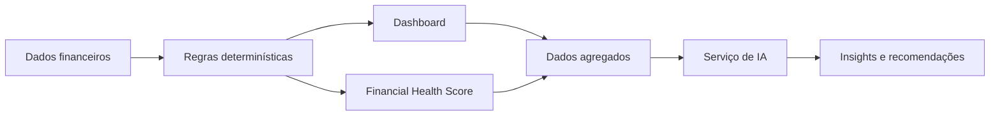
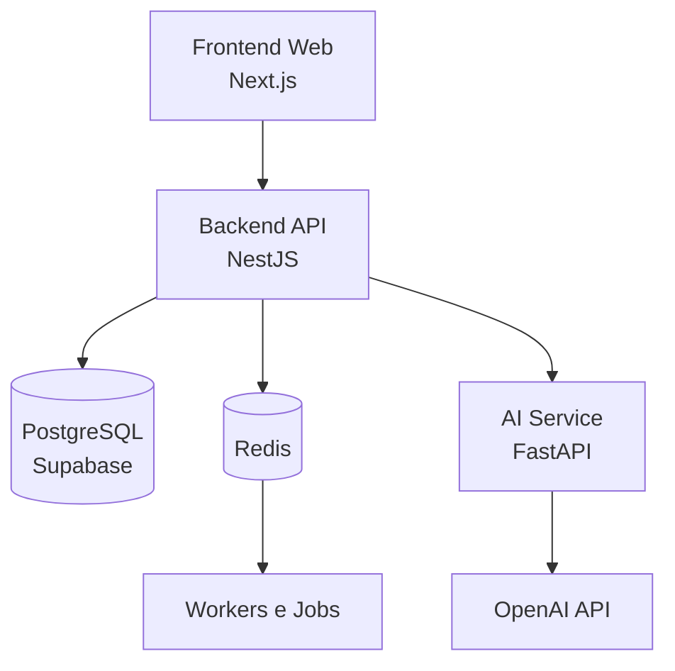
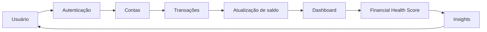
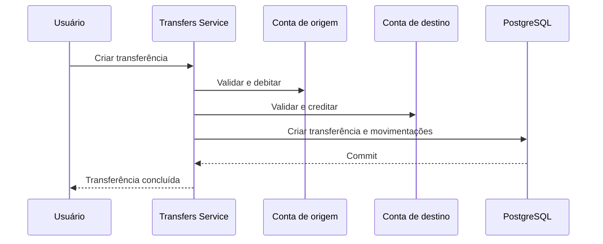
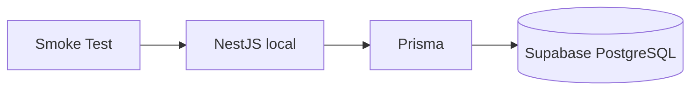
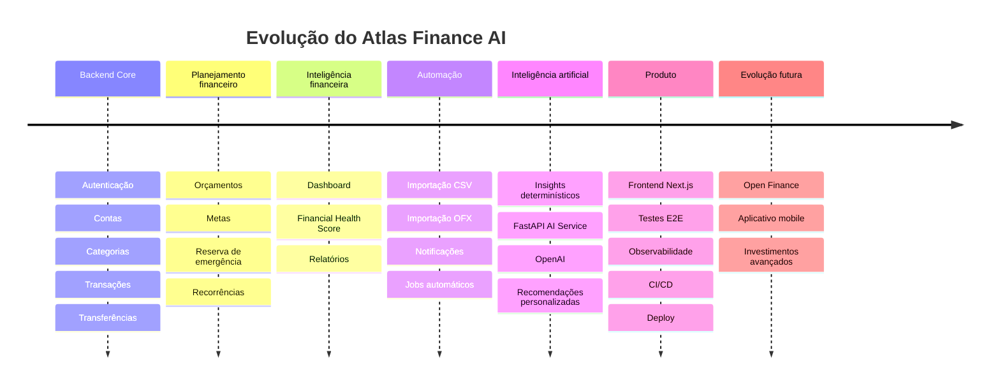

<div align="center">

# Atlas Finance AI

### Financial intelligence built on reliable data.

Plataforma de gestão financeira pessoal desenvolvida para transformar movimentações financeiras em organização, indicadores, planejamento e insights inteligentes.

<br />


<br />


<br />

[Visão do produto](#visão-do-produto) ·
[Arquitetura](#arquitetura) ·
[Funcionalidades](#funcionalidades) ·
[Instalação](#execução-local) ·
[Roadmap](#roadmap)

</div>

---

## Sobre o Atlas Finance AI

O **Atlas Finance AI** é uma plataforma de gestão financeira pessoal criada para centralizar contas, movimentações, orçamentos, metas, compromissos recorrentes e indicadores financeiros em um único sistema.

O projeto não nasceu com o objetivo de ser apenas mais um aplicativo de cadastro de receitas e despesas.

Sua proposta é construir um **motor financeiro confiável**, capaz de:

- organizar dados financeiros;
- aplicar regras de negócio determinísticas;
- manter saldos consistentes;
- gerar indicadores explicáveis;
- avaliar a saúde financeira;
- identificar comportamentos relevantes;
- fornecer informações estruturadas para inteligência artificial;
- ajudar o usuário a tomar decisões melhores.

O sistema está sendo construído com foco inicial no backend financeiro. O frontend, os serviços assíncronos e a camada de inteligência artificial fazem parte das próximas etapas de desenvolvimento.

---

# Visão do produto

Administrar a vida financeira normalmente envolve informações espalhadas entre:

- aplicativos bancários;
- planilhas;
- anotações;
- carteiras digitais;
- contas em diferentes instituições;
- serviços de assinatura;
- metas criadas informalmente.

O Atlas busca transformar esse conjunto fragmentado em uma visão financeira única.

A plataforma deverá permitir que o usuário compreenda:

- quanto possui em cada conta;
- quanto recebeu e gastou;
- para onde o dinheiro está indo;
- quais categorias mais consomem sua renda;
- se seus orçamentos estão sendo respeitados;
- quanto falta para alcançar suas metas;
- quais cobranças futuras estão previstas;
- como seu patrimônio está evoluindo;
- qual é o estado atual de sua saúde financeira;
- quais decisões podem melhorar sua situação.

---

# Filosofia do projeto

A filosofia central do Atlas pode ser resumida em quatro responsabilidades:

```text
O backend calcula.
O Dashboard apresenta.
O Financial Health Score avalia.
A inteligência artificial interpreta.
```

A inteligência artificial não é responsável por calcular:

- saldos;
- receitas;
- despesas;
- percentuais;
- patrimônio;
- progresso de metas;
- consumo de orçamento;
- pontuação financeira.

Todos esses valores são produzidos pelo backend utilizando regras determinísticas e testáveis.

A IA receberá dados já calculados para produzir:

- explicações;
- resumos;
- recomendações;
- alertas;
- comparações;
- projeções narrativas.

Essa separação torna o sistema:

- previsível;
- auditável;
- reproduzível;
- seguro;
- testável;
- preparado para crescer.

---

## Fluxo de inteligência financeira



A IA interpreta o resultado do motor financeiro, mas não altera nem substitui suas regras.

---

# Princípios fundamentais

## PostgreSQL como fonte de verdade

Todos os dados financeiros persistentes pertencem ao PostgreSQL.

Isso inclui:

- usuários;
- sessões;
- contas;
- transações;
- transferências;
- categorias;
- orçamentos;
- metas;
- recorrências;
- scores;
- insights;
- auditoria.

Redis poderá ser utilizado futuramente para:

- cache;
- filas;
- locks;
- rate limiting;
- processamento assíncrono.

Porém, Redis nunca será a fonte definitiva dos dados financeiros.

---

## Precisão monetária

Dinheiro não é tratado com ponto flutuante.

Os valores financeiros utilizam:

```text
PostgreSQL DECIMAL(19,4)
Prisma.Decimal
```

Regras monetárias:

- valores entram pela API como strings;
- valores são processados com `Prisma.Decimal`;
- valores são retornados como strings;
- não existem cálculos financeiros com `float`;
- notação científica é rejeitada;
- valores inválidos são bloqueados;
- operações dependentes são atômicas.

---

## Segurança por padrão

Nenhuma rota financeira confia em um `userId` enviado pelo cliente.

O usuário é identificado exclusivamente pelo contexto autenticado.

```text
JWT
  ↓
JwtAuthGuard
  ↓
CurrentUser
  ↓
Consultas filtradas pelo proprietário
```

Recursos financeiros normalmente são consultados utilizando:

```text
id
userId
deletedAt: null
```

Isso reduz riscos de IDOR e evita que um usuário descubra ou acesse recursos de outro.

---

## Operações atômicas

Operações que alteram múltiplos registros utilizam transações do Prisma.

Exemplos:

- criação de transação e atualização do saldo;
- alteração de valor de uma transação;
- mudança de conta;
- transferência entre contas;
- reversão de transferência;
- contribuição para uma meta;
- saque de uma meta;
- geração de transação recorrente.

Caso qualquer etapa falhe, toda a operação é revertida.

---

## Soft delete

Entidades financeiras importantes não são removidas fisicamente de forma imediata.

A exclusão lógica preserva:

- histórico;
- auditoria;
- relacionamentos;
- integridade referencial;
- rastreabilidade;
- consistência dos cálculos.

---

## Auditoria

Eventos relevantes são registrados de forma sanitizada.

A auditoria pode armazenar:

- tipo da ação;
- entidade envolvida;
- identificadores;
- momento da operação;
- metadados necessários.

A auditoria não deve armazenar:

- senha;
- hash de senha;
- access token;
- refresh token;
- connection string;
- payloads sensíveis completos.

---

# Arquitetura

O Atlas está organizado como um monorepo preparado para reunir a API principal, o futuro frontend e serviços auxiliares.



---

## Camadas planejadas

### Frontend

Responsável pela experiência do usuário e apresentação dos dados.

Stack planejada:

- Next.js;
- TypeScript;
- Tailwind CSS;
- Shadcn UI;
- TanStack Query;
- Zustand;
- Recharts.

### Backend API

Responsável por:

- autenticação;
- autorização;
- regras financeiras;
- persistência;
- auditoria;
- validação;
- dashboards;
- score financeiro;
- orquestração de jobs;
- integração com o serviço de IA.

Stack atual:

- NestJS;
- TypeScript;
- Prisma;
- PostgreSQL.

### Banco de dados

Responsável por armazenar toda a informação permanente da plataforma.

O Supabase é utilizado exclusivamente como PostgreSQL remoto.

Não são utilizados como backend da aplicação:

- Supabase Auth;
- Supabase Edge Functions;
- Supabase Data API.

### Serviço de IA

O serviço de IA será isolado da persistência financeira.

Ele receberá apenas dados:

- agregados;
- minimizados;
- estruturados;
- sem credenciais;
- sem tokens;
- sem informações pessoais desnecessárias.

O serviço não terá acesso direto ao PostgreSQL.

---

# Fluxo geral da aplicação



---

# Estrutura do projeto

```text
atlas-finance-ai/
│
├── apps/
│   └── api/
│       └── src/
│           ├── config/
│           ├── modules/
│           │   ├── accounts/
│           │   ├── audit/
│           │   ├── auth/
│           │   ├── budgets/
│           │   ├── categories/
│           │   ├── dashboard/
│           │   ├── financial/
│           │   ├── goals/
│           │   ├── health/
│           │   ├── prisma/
│           │   ├── recurring-transactions/
│           │   ├── transactions/
│           │   ├── transfers/
│           │   └── users/
│           │
│           ├── test-utils/
│           ├── app.module.ts
│           └── main.ts
│
├── docs/
│   ├── PRD.md
│   ├── ARCHITECTURE.md
│   ├── DATABASE.md
│   ├── SECURITY.md
│   └── relatórios de implementação
│
├── prisma/
│   ├── schema.prisma
│   └── migrations/
│
├── scripts/
├── supabase/
│   └── rls/
│
├── .env.example
├── package.json
├── prisma.config.ts
└── README.md
```

---

# Funcionalidades

## Autenticação própria

A autenticação é implementada pelo NestJS.

O Atlas não utiliza Supabase Auth.

Recursos existentes:

- cadastro;
- login;
- logout;
- access token JWT;
- refresh token;
- rotação obrigatória;
- sessões persistidas;
- hash de refresh token;
- revogação;
- detecção de reutilização;
- proteção de rotas;
- auditoria.

Endpoints principais:

```http
POST /api/v1/auth/register
POST /api/v1/auth/login
POST /api/v1/auth/refresh
POST /api/v1/auth/logout
GET  /api/v1/auth/me
```

As senhas são protegidas com Argon2id.

---

## Contas financeiras

O usuário pode manter diferentes contas financeiras.

Exemplos:

- conta corrente;
- conta digital;
- carteira;
- conta de investimento.

O módulo controla:

- nome;
- tipo;
- moeda;
- saldo inicial;
- saldo atual;
- status;
- arquivamento;
- soft delete.

`initialBalance` permanece imutável após a criação da conta.

Movimentações alteram somente `currentBalance`.

---

## Categorias

Categorias organizam receitas e despesas.

Existem:

- categorias pessoais;
- categorias globais;
- categorias de receita;
- categorias de despesa;
- hierarquia opcional;
- ordenação;
- status;
- soft delete.

Categorias globais são disponibilizadas pela plataforma e não podem ser alteradas por usuários comuns.

---

## Transações

O módulo de transações controla receitas, despesas e ajustes previstos pelo domínio.

Funcionalidades:

- criação;
- consulta;
- paginação;
- filtros;
- atualização;
- alteração de valor;
- mudança de conta;
- mudança de tipo;
- mudança de status;
- soft delete;
- auditoria;
- atualização atômica de saldo.

Quando uma transação é alterada:

```text
Impacto anterior é revertido
             ↓
Novos dados são aplicados
             ↓
Novo impacto atualiza o saldo
```

Toda a operação acontece dentro de uma transação Prisma.

---

## Transferências

Transferências movimentam valores entre contas do mesmo usuário.

Uma transferência:

- debita a conta de origem;
- credita a conta de destino;
- cria movimentações vinculadas;
- preserva o histórico;
- permite reversão;
- utiliza a mesma moeda;
- não é considerada receita;
- não é considerada despesa.



Caso qualquer operação falhe, todas são revertidas.

---

## Orçamentos mensais

O usuário pode definir limites mensais para categorias de despesas.

Para cada limite, o sistema calcula:

- valor definido;
- valor consumido;
- valor restante;
- percentual utilizado;
- status.

```text
Abaixo de 80%        → NORMAL
De 80% até 99,99%    → ALERT
100% ou mais         → EXCEEDED
```

O cálculo considera apenas despesas:

- confirmadas;
- pertencentes ao usuário;
- dentro do período;
- na moeda correta;
- não removidas;
- vinculadas à categoria.

---

## Metas financeiras

As metas permitem planejar objetivos financeiros.

Exemplos:

- reserva de emergência;
- viagem;
- computador;
- veículo;
- investimento.

O módulo oferece:

- criação;
- atualização;
- valor-alvo;
- valor atual;
- moeda;
- prazo;
- contribuições;
- saques;
- reversões;
- progresso;
- paginação;
- filtros;
- auditoria;
- soft delete.

Contribuições e saques atualizam o valor da meta atomicamente.

---

## Reserva de emergência

A reserva de emergência faz parte da visão original do produto.

Ela pode utilizar:

- meta do tipo `EMERGENCY_FUND`;
- plano específico de reserva;
- média de despesas essenciais;
- cobertura em meses;
- valor recomendado;
- progresso acumulado.

Exemplo:

```text
Despesas essenciais mensais: R$ 2.500
Cobertura desejada: 6 meses
Reserva recomendada: R$ 15.000
```

Esses dados alimentam o futuro Financial Health Score.

---

## Transações recorrentes

O módulo de recorrências controla receitas e despesas previstas.

Frequências atualmente previstas pelo modelo:

- semanal;
- mensal;
- anual.

O módulo permite:

- criar;
- consultar;
- atualizar;
- pausar;
- retomar;
- cancelar;
- executar manualmente;
- gerar transação real;
- atualizar saldo;
- avançar a próxima ocorrência;
- soft delete.

Datas são calculadas em UTC.

Quando uma recorrência mensal utiliza o dia 31, meses menores utilizam o último dia válido.

A execução utiliza proteção otimista para reduzir riscos de duplicidade.

---

## Dashboard financeiro

O Dashboard consolida informações dos módulos financeiros.

Endpoints disponíveis:

```http
GET /api/v1/dashboard/overview
GET /api/v1/dashboard/cash-flow
GET /api/v1/dashboard/categories
GET /api/v1/dashboard/accounts
GET /api/v1/dashboard/budgets
GET /api/v1/dashboard/goals
GET /api/v1/dashboard/recurring
GET /api/v1/dashboard/recent-transactions
```

O Dashboard oferece:

- saldo por moeda;
- receitas;
- despesas;
- fluxo líquido;
- comparação com período anterior;
- evolução temporal;
- distribuição por categoria;
- resumo de contas;
- consumo de orçamentos;
- progresso de metas;
- próximas recorrências;
- movimentações recentes.

O Dashboard não persiste métricas desnecessariamente.

Os valores são calculados a partir da fonte de verdade.

---

## Financial Health Score

O Financial Health Score está sendo desenvolvido como um sistema determinístico de avaliação financeira.

Componentes planejados:

| Componente | Peso |
|---|---:|
| Taxa de poupança | 25% |
| Controle de orçamento | 20% |
| Reserva de emergência | 25% |
| Progresso de metas | 15% |
| Evolução patrimonial | 15% |

O score será calculado de 0 a 100.

Classificações previstas pelo modelo atual:

```text
CRITICAL
ATTENTION
GOOD
EXCELLENT
```

O módulo também deverá retornar:

- score por componente;
- peso efetivo;
- qualidade dos dados;
- fatores positivos;
- fatores negativos;
- recomendações estruturadas.

A inteligência artificial não calcula o score.

Ela utilizará o score futuramente para produzir explicações.

---

# Tratamento de moedas

O Atlas não mistura valores de moedas diferentes.

Exemplo:

```json
{
  "balances": [
    {
      "currency": "BRL",
      "amount": "4500.0000"
    },
    {
      "currency": "USD",
      "amount": "200.0000"
    }
  ]
}
```

O sistema não realiza conversão cambial automaticamente.

Indicadores, Dashboards e scores devem ser calculados por moeda.

---

# Infraestrutura financeira tipada

Para reduzir o acoplamento com o Prisma, os serviços financeiros utilizam portas e adapters.

Componentes compartilhados incluem:

```text
FinancialDatabasePort
FinancialDatabaseAdapter
FINANCIAL_DATABASE
FinancialPrismaMock
financial-fixtures.ts
money.ts
```

Módulos especializados podem possuir portas próprias, como:

```text
FinancialHealthDatabasePort
DashboardDatabasePort
ReportsDatabasePort
```

Essa abordagem permite:

- dependency injection explícita;
- testes isolados;
- mocks Jest tipados;
- ausência de `any`;
- ausência de casts inseguros;
- manutenção mais segura.

---

# Banco de dados

O `prisma/schema.prisma` é a fonte de verdade do modelo de dados.

O banco utiliza:

- PostgreSQL;
- UUIDs;
- foreign keys;
- enums;
- índices;
- unique constraints;
- `DECIMAL(19,4)`;
- `TIMESTAMPTZ`;
- soft delete.

Arquitetura de conexão:

```mermaid
flowchart LR
    API[NestJS API]
    PRISMA[Prisma 7]
    ADAPTER[@prisma/adapter-pg]
    POOLER[Supabase Transaction Pooler]
    DB[(PostgreSQL)]

    API --> PRISMA
    PRISMA --> ADAPTER
    ADAPTER --> POOLER
    POOLER --> DB
```

---

# Health checks

A API possui endpoints separados para monitoramento.

```http
GET /api/v1/health
GET /api/v1/health/liveness
GET /api/v1/health/readiness
```

O readiness verifica a comunicação real com o PostgreSQL.

Exemplo de resposta:

```json
{
  "services": {
    "app": {
      "status": "up"
    },
    "database": {
      "status": "up"
    }
  },
  "status": "ok"
}
```

---

# Stack tecnológica

## Backend


- Node.js;
- NestJS 11;
- TypeScript strict;
- RxJS;
- Class Validator;
- Class Transformer.

## Persistência


- Prisma 7;
- PostgreSQL;
- Supabase;
- `@prisma/adapter-pg`;
- `pg`.

## Segurança

- JWT;
- Argon2id;
- refresh token rotation;
- sessões persistidas;
- guards;
- validação de ambiente;
- proteção contra IDOR;
- auditoria.

## Qualidade


- Jest;
- Supertest;
- ESLint;
- TypeScript strict;
- fixtures tipadas;
- mocks Jest tipados;
- testes unitários;
- smoke tests;
- validação de build.

## Futuro frontend

- Next.js;
- Tailwind CSS;
- Shadcn UI;
- TanStack Query;
- Zustand;
- Recharts.

## Futuro serviço de IA

- Python;
- FastAPI;
- OpenAI API;
- outputs estruturados;
- prompts versionados;
- payloads minimizados.

## Infraestrutura planejada

- Redis;
- workers;
- filas;
- locks distribuídos;
- rate limiting;
- OpenTelemetry;
- Sentry;
- CI/CD.

---

# Execução local

## Pré-requisitos

- Node.js;
- npm;
- Git;
- projeto PostgreSQL ou Supabase;
- credenciais de conexão.

---

## Clonar o repositório

```bash
git clone https://github.com/oluisvi/atlas-finance-ai.git
cd atlas-finance-ai
```

---

## Instalar dependências

```bash
npm install
```

---

## Configurar o ambiente

Utilize o script:

```bash
npm run setup:env
```

Ou copie manualmente:

### Linux e macOS

```bash
cp .env.example .env
```

### Windows CMD

```cmd
copy .env.example .env
```

### Windows PowerShell

```powershell
Copy-Item .env.example .env
```

Depois, preencha as credenciais reais no `.env`.

Nunca envie o arquivo `.env` ao Git.

---

# Variáveis de ambiente

Exemplo básico:

```env
NODE_ENV="development"

API_PORT="3000"
API_PREFIX="api"
API_VERSION="1"

DATABASE_URL="postgresql://..."
DIRECT_URL="postgresql://..."

JWT_ACCESS_SECRET="..."
JWT_REFRESH_SECRET="..."

JWT_ACCESS_TTL="15m"
JWT_REFRESH_TTL="30d"

JWT_ISSUER="atlas-finance-ai"
JWT_AUDIENCE="atlas-finance-ai"
```

## DATABASE_URL

Utilizada durante a execução da API.

Deve apontar para o Supabase Transaction Pooler.

## DIRECT_URL

Utilizada somente para:

- migrations;
- introspecção;
- validação administrativa;
- verificação do catálogo.

A API não utiliza `DIRECT_URL` em runtime.

---

# Iniciar a API

Valide o schema:

```bash
npm run prisma:validate
```

Gere o Prisma Client:

```bash
npm run prisma:generate
```

Inicie a aplicação:

```bash
npm run start:api
```

A API será disponibilizada normalmente em:

```text
http://localhost:3000/api/v1
```

Verifique:

```text
http://localhost:3000/api/v1/health/readiness
```

---

# Scripts disponíveis

```bash
# API em desenvolvimento
npm run start:api

# Build de produção
npm run build

# Executar build compilado
npm run start:api:prod

# TypeScript
npm run typecheck

# Testes
npm run test

# ESLint
npm run lint

# Prisma
npm run prisma:validate
npm run prisma:generate
npm run prisma:migrate:deploy
npm run prisma:migrate:diff

# Banco
npm run db:verify-catalog
npm run db:expected-catalog

# Ambiente
npm run setup:env
```

---

# Testes e qualidade

Antes de uma etapa ser considerada concluída, são executados:

```bash
npm run prisma:validate
npm run prisma:generate
npm run typecheck
npm run test
npm run lint
npm run build
git diff --check
```

Além da suíte automatizada, os módulos financeiros passam por smoke tests reais.



Os testes utilizam dados controlados e nunca registram:

- senhas;
- tokens;
- connection strings;
- headers sensíveis.

---

# Estado atual

| Área | Estado |
|---|:---:|
| Backend Foundation | Concluído |
| Supabase PostgreSQL | Concluído |
| Prisma | Concluído |
| Health Checks | Concluído |
| Autenticação | Concluído |
| Usuários | Concluído |
| Contas | Concluído |
| Categorias | Concluído |
| Transações | Concluído |
| Transferências | Concluído |
| Orçamentos | Concluído |
| Metas | Concluído |
| Transações recorrentes | Concluído |
| Dashboard | Concluído |
| Financial Health Score | Em desenvolvimento |
| Importação CSV/OFX | Planejado |
| Relatórios | Planejado |
| Insights | Planejado |
| Serviço de IA | Planejado |
| Notificações | Planejado |
| Redis e workers | Planejado |
| Frontend | Planejado |
| Deploy | Planejado |

---

# Roadmap



---

# Etapas futuras

## Financial Health Score

Finalizar:

- controle de orçamento;
- reserva de emergência;
- progresso de metas;
- evolução patrimonial;
- fatores positivos e negativos;
- recomendações estruturadas;
- qualidade dos dados;
- histórico.

## Importação financeira

Implementar:

- CSV;
- OFX;
- preview;
- mapeamento;
- deduplicação;
- revisão;
- importação atômica;
- relatório de erros.

## Relatórios

Criar:

- resumo mensal;
- resumo anual;
- fluxo de caixa;
- gastos por categoria;
- orçamento planejado versus realizado;
- evolução patrimonial;
- progresso de metas.

## Insights financeiros

Detectar:

- aumento de gastos;
- risco de orçamento;
- recorrências desnecessárias;
- queda no fluxo de caixa;
- evolução de metas;
- mudanças no score.

## Serviço de IA

O serviço de IA receberá dados estruturados como:

```json
{
  "financialHealth": {},
  "cashFlow": {},
  "budgets": {},
  "goals": {},
  "spendingTrends": {},
  "recurringCommitments": {}
}
```

E poderá produzir:

- explicações;
- resumos;
- recomendações;
- alertas;
- projeções narrativas.

## Frontend

Páginas planejadas:

```text
/login
/register
/dashboard
/accounts
/transactions
/transfers
/budgets
/goals
/recurring
/imports
/reports
/insights
/settings
```

---

# Documentação

A pasta `docs` registra decisões de produto e engenharia.

Principais documentos:

```text
PRD.md
ARCHITECTURE.md
DATABASE.md
SECURITY.md

SUPABASE_MIGRATION_REPORT.md
DATABASE_REVIEW.md
BACKEND_FOUNDATION_REPORT.md
AUTH_IMPLEMENTATION_REPORT.md
ACCOUNTS_CATEGORIES_IMPLEMENTATION_REPORT.md
TRANSACTIONS_TRANSFERS_IMPLEMENTATION_REPORT.md
BUDGETS_IMPLEMENTATION_REPORT.md
GOALS_IMPLEMENTATION_REPORT.md
RECURRING_TRANSACTIONS_IMPLEMENTATION_REPORT.md
DASHBOARD_IMPLEMENTATION_REPORT.md
```

Os relatórios registram:

- arquitetura;
- entidades utilizadas;
- endpoints;
- regras financeiras;
- testes;
- smoke tests;
- bugs encontrados;
- limitações;
- riscos;
- próximos passos.

---

# Decisões importantes

## O Atlas não é um chatbot financeiro

A IA não terá acesso livre ao banco.

Ela não poderá executar movimentações ou alterar saldos.

## O backend é responsável pelas regras

Toda decisão financeira mensurável deve ser reproduzível sem IA.

## O Dashboard é uma camada de leitura

O Dashboard agrega informações, mas não altera dados financeiros.

## O score é explicável

Cada componente do Financial Health Score deve indicar:

- peso;
- nota;
- métricas utilizadas;
- motivos;
- qualidade dos dados.

## O sistema deve crescer sem perder consistência

Novos módulos devem reutilizar as regras existentes, evitando versões diferentes do mesmo cálculo em múltiplos lugares.

---

# Visão de longo prazo

O objetivo de longo prazo é transformar o Atlas em uma plataforma que ajude o usuário a sair de:

```text
"Eu registro meus gastos."
```

para:

```text
"Eu entendo minha situação financeira."
```

e, posteriormente:

```text
"Eu sei quais decisões tomar para melhorar."
```

O produto deverá unir:

- organização;
- planejamento;
- automação;
- análise;
- inteligência artificial;
- segurança;
- clareza.

---

# Autor

Desenvolvido por **Luis Henrique Vieira**.

[](https://github.com/oluisvi)

---

# Licença

Este projeto ainda não possui uma licença pública definida.

Até que uma licença seja adicionada ao repositório, todos os direitos permanecem reservados ao autor.

---

<div align="center">

### Atlas Finance AI

**Reliable financial rules. Clear indicators. Intelligent decisions.**

</div>
