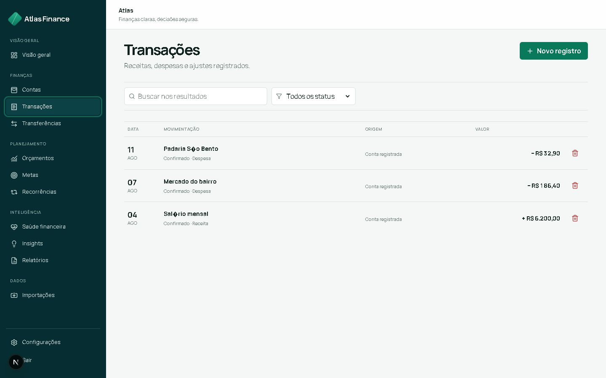
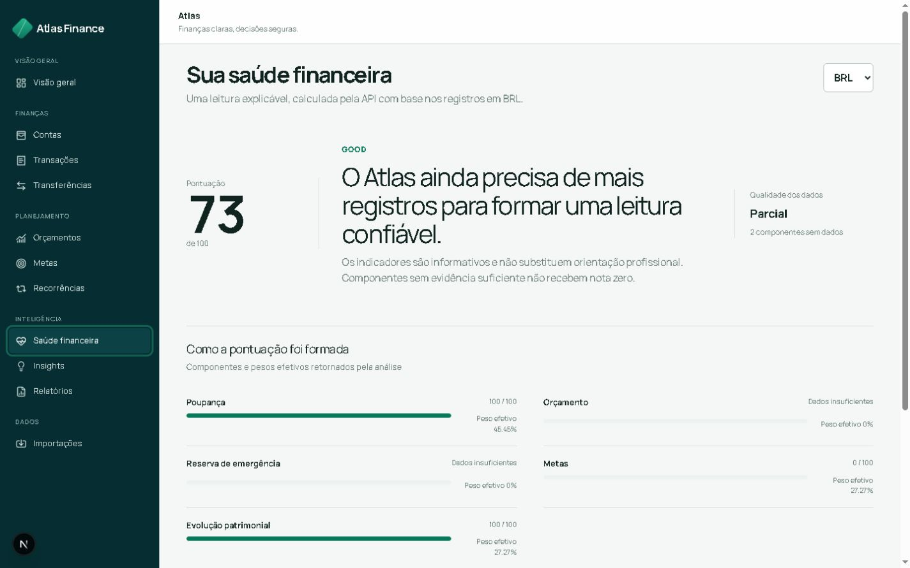
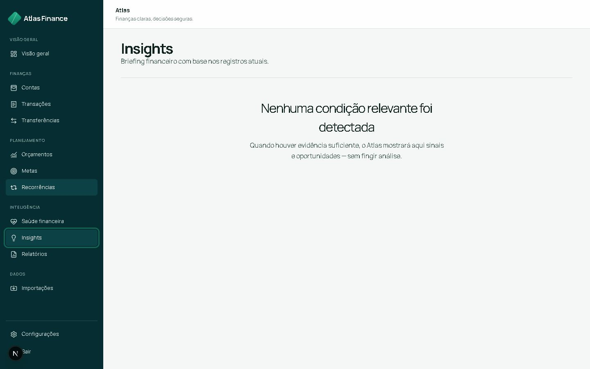
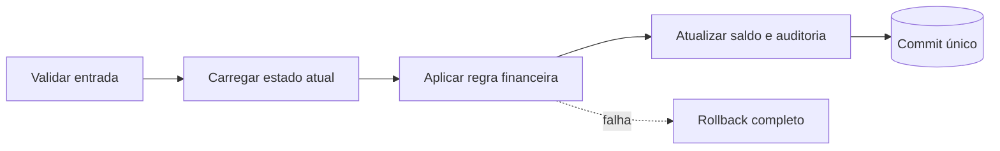
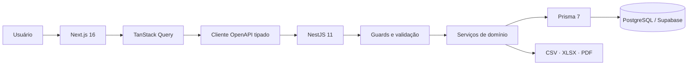
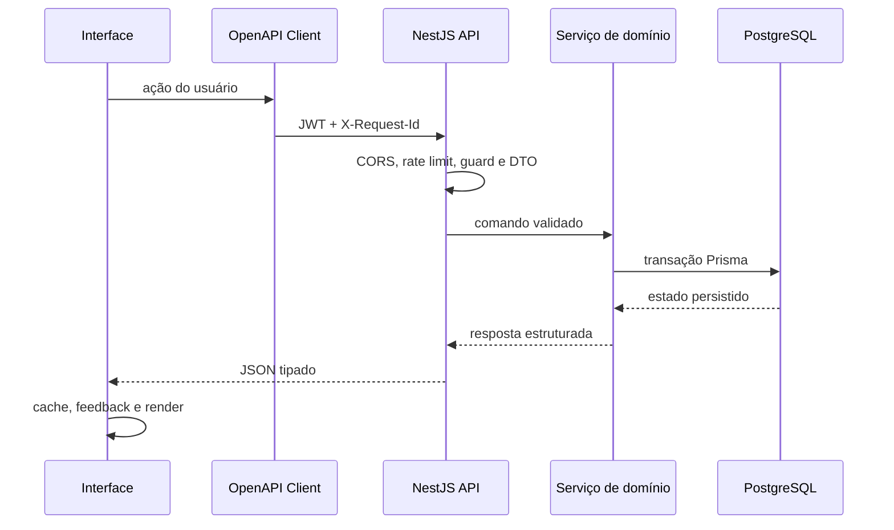
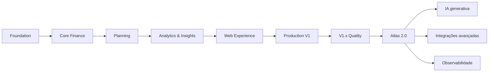

<div align="center">


# Atlas Finance AI

### Gestão financeira pessoal confiável, explicável e multi-moeda.

[](https://nextjs.org/)
[](https://nestjs.com/)
[](https://www.typescriptlang.org/)
[](https://www.postgresql.org/)
[](docs/API.md)
[](#qualidade)
[](docs/UX_PWA_DEPLOYMENT_IMPLEMENTATION_REPORT.md)

**[Abrir aplicação](https://atlas-finance-web.onrender.com/) · [Documentação](docs/) · [Arquitetura](docs/ARCHITECTURE.md) · [Segurança](docs/SECURITY.md)**

</div>

---

## Sobre o Atlas

O **Atlas Finance AI** é uma plataforma full-stack de finanças pessoais criada para transformar registros financeiros em **entendimento, planejamento e ação**.

Em vez de apenas registrar receitas e despesas, o Atlas conecta contas, movimentações, orçamentos, metas, diagnósticos e relatórios em uma única experiência.

O produto foi construído em torno de quatro perguntas:

1. **Onde está meu dinheiro?** — contas, saldos e patrimônio por moeda.
2. **O que mudou?** — receitas, despesas, transferências e recorrências.
3. **Como estou?** — orçamentos, metas, reserva e saúde financeira.
4. **O que merece atenção?** — insights determinísticos, relatórios e próximos passos.


### Princípios do produto

- **Confiabilidade antes de conveniência:** regras financeiras críticas vivem no backend.
- **Explicabilidade antes de magia:** score e insights mostram sua base.
- **Moeda é domínio:** BRL, USD e EUR nunca são somados implicitamente.
- **Dados insuficientes não viram zero:** ausência de informação não é apresentada como precisão.
- **Segurança faz parte do produto:** autenticação, autorização e privacidade são estruturais.
- **IA não é autoridade financeira:** a versão atual prioriza análises determinísticas e auditáveis.

> **Familiaridade na interação. Identidade na composição. Confiabilidade nas regras.**

---

## Produto em uso

O design system **Atlas Mineral** combina clareza editorial, densidade de produto financeiro e uma identidade inspirada em orientação, trajetórias e camadas de informação.

A interface foi projetada para evitar tanto o dashboard administrativo genérico quanto experiências excessivamente experimentais.

### Financial Briefing

O dashboard concentra posição financeira, comportamento do período, sinais relevantes e próximas ações.

Cada moeda é analisada separadamente e a ausência de dados nunca é apresentada como falsa precisão.


### Financial Ledger

As movimentações são organizadas para facilitar leitura por conta, categoria, período, status e valor.



### Saúde financeira explicável

O Atlas apresenta score, qualidade dos dados, fatores e recomendações mantendo visível a base utilizada pelo diagnóstico.



### Insights

Sinais financeiros são detectados de forma determinística, classificados por severidade e apresentados com contexto.



### Contas

Contas são organizadas por instituição, tipo, moeda, saldo e status.

Identificadores internos permanecem no contrato entre frontend e API; a interface utiliza nomes e informações compreensíveis para o usuário.


### Experiência responsiva

No desktop, o Atlas privilegia tabelas, leitura comparativa e maior densidade de informação.

Em telas menores, a navegação e os componentes financeiros são reorganizados para preservar legibilidade e interação.

<p align="center">
  
</p>

---

## Principais capacidades

| Domínio | O que o Atlas entrega |
| --- | --- |
| **Autenticação** | Cadastro, login, access token, refresh rotativo, sessão e logout |
| **Contas e categorias** | Contas multi-moeda, categorias globais/pessoais, saldos e arquivamento |
| **Transações** | Receitas, despesas e ajustes com filtros, auditoria e impacto atômico |
| **Transferências** | Débito e crédito atômicos, neutralidade patrimonial e mesma moeda |
| **Orçamentos** | Limites mensais por categoria, consumo, restante e alertas |
| **Metas** | Objetivos, contribuições, retiradas, progresso, prioridade e prazo |
| **Reserva de emergência** | Cobertura em meses, progresso e diagnóstico explicável |
| **Recorrências** | Compromissos futuros, frequência, pausa, retomada e execução idempotente |
| **Dashboard** | Patrimônio, fluxo de caixa, mudanças, atenção e movimentos recentes |
| **Saúde financeira** | Score determinístico, qualidade dos dados, pesos, fatores e recomendações |
| **Insights** | Detectores determinísticos, severidade, deduplicação e ciclo de vida |
| **Importações** | CSV, OFX e QFX com parsing, preview, revisão e deduplicação |
| **Relatórios** | Resumo, fluxo de caixa, categorias, patrimônio, metas e orçamentos |
| **Exportações** | Documentos CSV, XLSX e PDF gerados no backend |
| **Operação** | Health, liveness, readiness, request ID e shutdown gracioso |

---

## Regras financeiras

A lógica financeira crítica permanece no backend e segue invariantes explícitos para evitar inconsistências entre interface, API e banco de dados.

### Dinheiro sem ponto flutuante

Valores monetários trafegam como strings decimais e são persistidos utilizando `DECIMAL(19,4)`.

```json
{
  "currency": "BRL",
  "amount": "1250.0000"
}
```

O frontend é responsável pela apresentação, mas nunca se torna fonte de verdade para cálculos financeiros.

### Múltiplas moedas sem soma implícita

```json
{
  "balances": [
    { "currency": "BRL", "amount": "4500.0000" },
    { "currency": "USD", "amount": "200.0000" }
  ]
}
```

Não existe conversão cambial automática.

Dashboard, relatórios, metas, budgets e score preservam o contexto da moeda selecionada.

### Atualizações atômicas

Operações que afetam estado financeiro são executadas de forma transacional.



### Datas com significado

- datas civis utilizam `YYYY-MM-DD`;
- instantes utilizam ISO 8601/UTC;
- o frontend não converte datas civis de forma que altere o dia;
- recorrências respeitam o último dia válido de cada mês.

---

## Arquitetura

O Atlas é estruturado como um **monorepo TypeScript**, separando interface, API, persistência e contratos.



### Responsabilidades

| Camada | Responsabilidade |
| --- | --- |
| **Next.js App Router** | Rotas, shell, composição responsiva, PWA e estados da interface |
| **React + TanStack Query** | Interação, mutations, cache e deduplicação de requests |
| **Typed OpenAPI Client** | Transporte HTTP consistente e tipos gerados pelo contrato |
| **NestJS** | Autenticação, autorização, validação e regras de negócio |
| **Prisma** | Acesso tipado, transações e precisão decimal |
| **PostgreSQL / Supabase** | Fonte de verdade, integridade relacional e persistência |

### Fluxo de uma requisição



### Estrutura do repositório

```text
atlas-finance-ai/
├── apps/
│   ├── api/                  # API NestJS e contrato OpenAPI
│   └── web/                  # Aplicação Next.js e PWA
├── docs/                     # Produto, arquitetura, segurança e relatórios
├── packages/                 # Código compartilhado
├── prisma/
│   ├── schema.prisma         # Modelo relacional
│   └── migrations/           # Evolução versionada
├── scripts/                  # Geração de contrato e verificações
├── supabase/                 # Políticas e configuração PostgreSQL
├── render.yaml               # Infraestrutura de deploy
└── package.json              # Orquestração do monorepo
```

---

## Stack

| Área | Tecnologias |
| --- | --- |
| **Frontend** | Next.js 16, React, TypeScript, Tailwind CSS |
| **Estado e dados** | TanStack Query, Zustand, React Hook Form, Zod |
| **Interface** | Radix UI, Lucide, Recharts, Sonner |
| **Backend** | NestJS 11, class-validator, JWT, Argon2 |
| **Banco de dados** | PostgreSQL/Supabase, Prisma 7, `Decimal(19,4)` |
| **Contrato** | OpenAPI 3, Swagger, openapi-typescript |
| **Arquivos** | CSV, ExcelJS/XLSX, PDFKit |
| **Qualidade** | Jest, Vitest, Testing Library, ESLint, TypeScript strict |
| **Deploy** | Render |

---

## Segurança

O modelo de segurança assume que toda entrada é não confiável e que dados financeiros pertencem exclusivamente ao usuário autenticado.

Entre os controles implementados estão:

- JWT de curta duração e refresh token rotativo;
- hash de senha com Argon2;
- guards de autenticação e autorização por recurso;
- proteção contra IDOR em serviços e queries;
- DTOs com whitelist e rejeição de campos extras;
- rate limiting;
- Helmet;
- CORS explícito;
- limites de payload;
- request IDs;
- erros sanitizados;
- secrets somente em variáveis de ambiente;
- PWA sem cache de respostas financeiras autenticadas;
- auditoria de operações financeiras relevantes.

O modelo completo está documentado em [`docs/SECURITY.md`](docs/SECURITY.md).

---

## Qualidade

A V1 possui uma suíte automatizada cobrindo API e frontend.

| Aplicação | Suítes | Testes | Resultado |
| --- | ---: | ---: | :---: |
| API NestJS | 37 | 288 | ✅ |
| Web Next.js | 5 | 15 | ✅ |
| **Total** | **42** | **303** | **✅** |

A validação integral inclui:

```bash
npm run prisma:validate
npm run prisma:generate
npm run api:generate
npm run typecheck
npm run test
npm run lint
npm run build
git diff --check
```

Além dos testes automatizados, o frontend é validado em browser quanto a:

- conteúdo significativo;
- overlays do framework;
- console;
- interação;
- responsividade;
- estados vazios;
- estados de erro.

Relatórios de implementação e auditoria estão disponíveis em [`docs/`](docs/).

---

## Deploy

A aplicação é executada no **Render** utilizando dois serviços independentes:

| Serviço | Responsabilidade |
| --- | --- |
| `atlas-finance-api` | API NestJS, Prisma e acesso ao PostgreSQL |
| `atlas-finance-web` | Aplicação Next.js de produção |

### Produção

**Frontend**

https://atlas-finance-web.onrender.com/

**API**

https://atlas-finance-api-we3t.onrender.com/

### Health endpoints

```text
GET /api/v1/health/liveness
GET /api/v1/health/readiness
```

O `render.yaml` mantém a infraestrutura de deploy versionada, incluindo builds independentes e configuração dos serviços.

Secrets e credenciais não são armazenados no manifesto e permanecem configurados diretamente no ambiente de produção.

Para detalhes operacionais, consulte [`docs/DEPLOYMENT.md`](docs/DEPLOYMENT.md).

---

## Execução local

### Requisitos

- Node.js `>=22 <23`;
- npm;
- PostgreSQL compatível ou projeto Supabase;
- variáveis de ambiente baseadas em `.env.example`.

### 1. Clonar e instalar

```bash
git clone https://github.com/oluisvi/atlas-finance-ai.git
cd atlas-finance-ai

npm install
npm --prefix apps/web install
```

### 2. Configurar ambiente

```bash
npm run setup:env
```

Preencha as variáveis obrigatórias sem versionar arquivos `.env`:

```dotenv
DATABASE_URL="postgresql://..."
DIRECT_URL="postgresql://..."

JWT_ACCESS_SECRET="..."
JWT_REFRESH_SECRET="..."

CORS_ORIGIN="http://localhost:3001"

NEXT_PUBLIC_API_URL="http://localhost:3000/api/v1"
```

### 3. Preparar banco e contrato

```bash
npm run prisma:validate
npm run prisma:generate
npm run prisma:migrate:deploy
npm run api:generate
```

### 4. Executar

API:

```bash
npm run start:api
```

Disponível em:

```text
http://localhost:3000/api/v1
```

Frontend:

```bash
npm run dev:web
```

Disponível em:

```text
http://localhost:3001
```

### Scripts principais

| Comando | Finalidade |
| --- | --- |
| `npm run start:api` | Compilar e iniciar a API |
| `npm run dev:web` | Iniciar o frontend em desenvolvimento |
| `npm run api:generate` | Atualizar OpenAPI e cliente TypeScript |
| `npm run prisma:validate` | Validar o schema Prisma |
| `npm run prisma:generate` | Gerar o Prisma Client |
| `npm run typecheck` | Verificar API e web em modo strict |
| `npm run test` | Executar todos os testes |
| `npm run lint` | Executar ESLint no monorepo |
| `npm run build` | Gerar builds de produção |
| `npm run db:verify-catalog` | Conferir o catálogo PostgreSQL |

---

## Documentação

A documentação técnica e de produto permanece versionada junto ao código.

| Documento | Conteúdo |
| --- | --- |
| [PRD](docs/PRD.md) | Problema, público, objetivos e requisitos |
| [Arquitetura](docs/ARCHITECTURE.md) | Componentes, responsabilidades e fluxos |
| [API](docs/API.md) | Contrato HTTP e convenções públicas |
| [Banco de dados](docs/DATABASE.md) | Modelo, integridade e persistência |
| [Segurança](docs/SECURITY.md) | Threat model, controles e operação segura |
| [Design System](docs/DESIGN_SYSTEM.md) | Tokens, componentes e linguagem Atlas Mineral |
| [Diretrizes de UX](docs/UX_GUIDELINES.md) | Formulários, estados, acessibilidade e responsividade |
| [Deployment](docs/DEPLOYMENT.md) | Ambientes, Render e checklist operacional |
| [Roadmap](docs/ROADMAP.md) | Evolução planejada do produto |

Os demais relatórios em [`docs/`](docs/) registram decisões, invariantes, endpoints, testes, auditorias e limitações de cada domínio.

---

## Estado atual

| Área | Estado |
| --- | :---: |
| Backend, banco e autenticação | ✅ |
| Domínios financeiros principais | ✅ |
| Dashboard | ✅ |
| Financial Health Score | ✅ |
| Insights determinísticos | ✅ |
| Imports CSV / OFX / QFX | ✅ |
| Relatórios e exportações | ✅ |
| OpenAPI e cliente tipado | ✅ |
| Frontend responsivo Atlas Mineral | ✅ |
| PWA segura | ✅ |
| Deploy full-stack | ✅ |
| E2E contínuo multi-browser | 🔜 |
| Observabilidade e CI/CD completos | 🔜 |
| IA generativa | 🔭 |
| Integrações financeiras avançadas | 🔭 |

### Limites atuais

O Atlas atualmente:

- não movimenta dinheiro;
- não conecta contas via Open Finance;
- não executa investimentos;
- não realiza conversão cambial automática;
- não oferece recomendações financeiras geradas por IA;
- não depende de Redis, filas ou workers para a V1 funcionar;
- não promete operação financeira completa offline.

Essas fronteiras são deliberadas.

A versão atual prioriza uma base financeira **correta, segura, previsível e explicável** antes da introdução de automações e inteligência generativa.

---

## Roadmap



### Foundation
Backend, PostgreSQL, autenticação, autorização e invariantes financeiros.

### Core Finance
Contas, categorias, transações, transferências e recorrências.

### Planning
Budgets, metas e reserva de emergência.

### Analytics & Insights
Dashboard, Financial Health Score, insights, relatórios e importações.

### Web Experience
Next.js, Atlas Mineral, responsividade, acessibilidade e PWA.

### Production V1
Deploy full-stack, health endpoints, segurança operacional e ambiente de produção.

### V1.x Quality
E2E contínuo, observabilidade, CI/CD e refinamentos de produto.

### Atlas 2.0
IA generativa com dados minimizados, explicações avançadas e novas integrações.

---

## Autor

Desenvolvido por **Luis Henrique Vieira**.

[](https://github.com/oluisvi)

---

## Licença

Este projeto ainda não possui licença pública definida.

Até que uma licença seja adicionada, todos os direitos permanecem reservados ao autor.

---

<div align="center">

### Atlas Finance AI

**Reliable financial rules. Clear indicators. Better decisions.**

[Aplicação](https://atlas-finance-web.onrender.com/) · [Documentação](docs/) · [GitHub](https://github.com/oluisvi)

</div>
